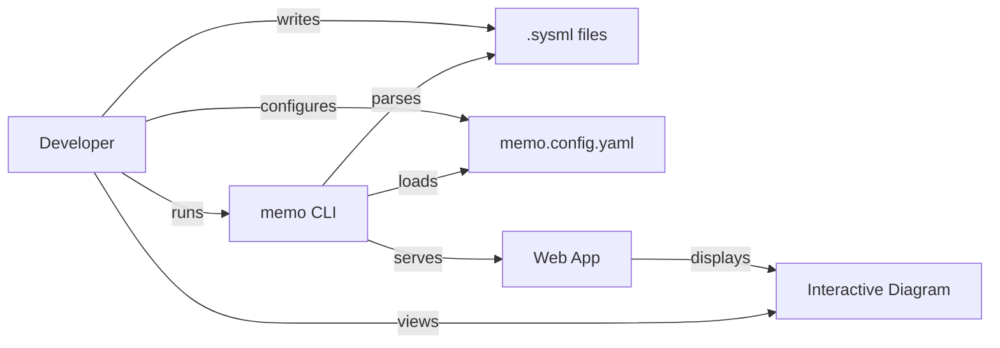
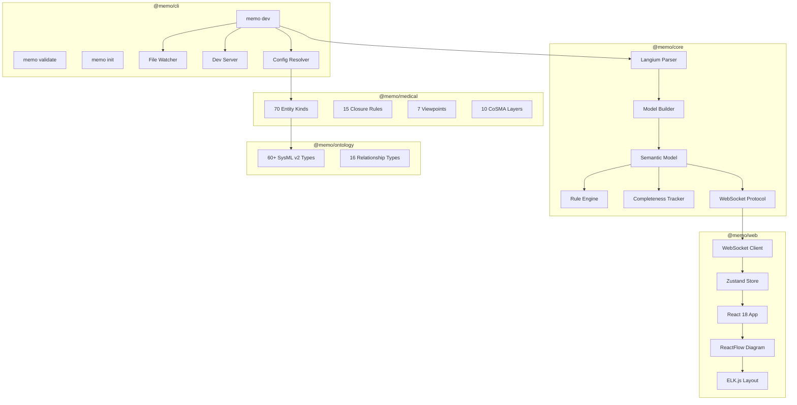

# Architecture Overview

MEMO is a monorepo containing 5 packages that form a layered architecture from parsing to visualization.

## System Context



## Package Architecture



## Package Responsibilities

| Package | Role | Key Exports |
|---|---|---|
| `@memo/core` | Parser, model, validation | `parseFiles`, `buildMemoModel`, `modelToDTO`, `evaluateClosureRules`, `computeCompleteness` |
| `@memo/ontology` | Base type system | SysML v2 type definitions (`.sysml` files) |
| `@memo/medical` | Domain config | `memo.config.yaml` with 70 kinds, 15 rules, 7 viewpoints |
| `@memo/cli` | CLI commands | `memo dev`, `memo validate`, `memo init` |
| `@memo/web` | Browser UI | React app with diagram, sidebar, completeness |

## Dependency Graph

```
@memo/web ──> @memo/core
@memo/cli ──> @memo/core
@memo/medical ──> @memo/ontology
@memo/core (standalone)
@memo/ontology (standalone)
```

The `@memo/core` package has zero runtime dependencies on domain packages. Domain knowledge flows through `memo.config.yaml` at runtime.
