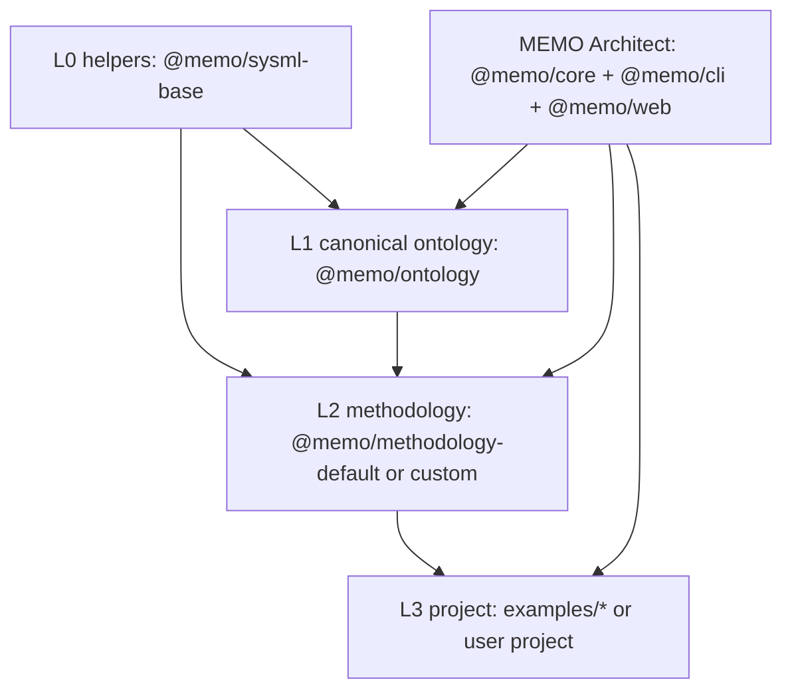

# Architecture Overview

This reference page summarizes the runtime architecture. The canonical product and ontology architecture lives in [../platform.md](../platform.md). Repo boundaries follow the executed three-repo split ([ADR-1-17](../../decisions/adr/ADR-1-17-three-repo-split.md)): content `memo` ◄ engine `memo-tools` (@memo/core + @memo/cli) ◄ web `memo-architect` (@memo/web — this repo), each consumed by the next as a git submodule.

## System Context

```mermaid
graph LR
    Author[Model Author] -->|edits| ProjectSysML[Project .sysml files]
    Author -->|pins| Config[memo.config.yaml methodology]
    Author -->|runs| CLI[memo CLI]

    CLI -->|loads once at startup| Ontology[Canonical @memo/ontology]
    CLI -->|loads once at startup| Methodology[@memo/methodology-*]
    CLI -->|parses on change| ProjectSysML
    CLI -->|serves| Web[MEMO Web App]
    Web -->|renders| Views[Model, compliance, artifact, and diagram views]
```

## Conceptual Stack



The core separation is:

| Layer | Owns | Does not own |
|---|---|---|
| L0 helpers | Common SysML library types, dimensions, rule/view base defs | Domain kinds |
| L1 ontology | Architecture, compliance, artifact, viewpoint kinds and invariant relationships/rules | Project scope or workflow |
| L2 methodology | Scope, aliases, workflow, tailoring, rule strengths | New ontology kinds unless extending ontology |
| L3 project | Concrete element instances and project configuration | Shared type definitions |

## Runtime Package Responsibilities

| Package / area | Role |
|---|---|
| `@memo/core` | Langium parser, semantic model builder, registries, validation, DTO conversion |
| `@memo/cli` | `memo dev`, `memo validate`, project bootstrap, file watching, WebSocket server |
| `@memo/web` | Browser UI, viewpoint filtering, diagrams, dashboards, artifact/compliance surfaces |
| `ontology/` | Local development checkout of the canonical ontology and methodology SysML packages |
| `examples/*` | Project instances that pin a methodology and contain concrete `.sysml` model files |

`@memo/core` has no compiled dependency on a specific domain package. Domain knowledge enters at runtime from parsed ontology and methodology SysML.

## UI Mapping

Tabs and workbenches are generic projections over ontology dimensions filtered by methodology scope:

| Surface | Source | Grouping |
|---|---|---|
| Model Explorer | Architecture dimension | `archLayer` selected by methodology |
| Compliance | Compliance dimension | standard and clause |
| Artifacts / DHF | Artifact dimension | document kind, regulatory reference, workflow stage |
| Diagrams | Viewpoint instances | viewpoint type selected by methodology |
| Methodology | Methodology package | scope, aliases, workflow, rule strengths |

Same project element may appear in multiple surfaces when its ontology kind carries multiple dimensions.
