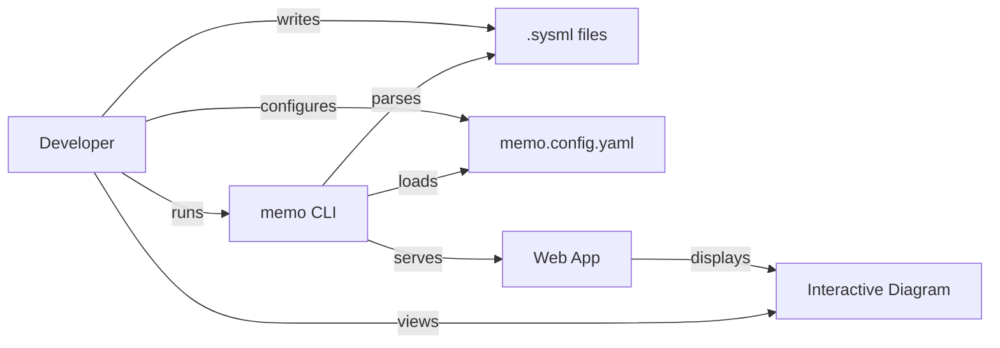
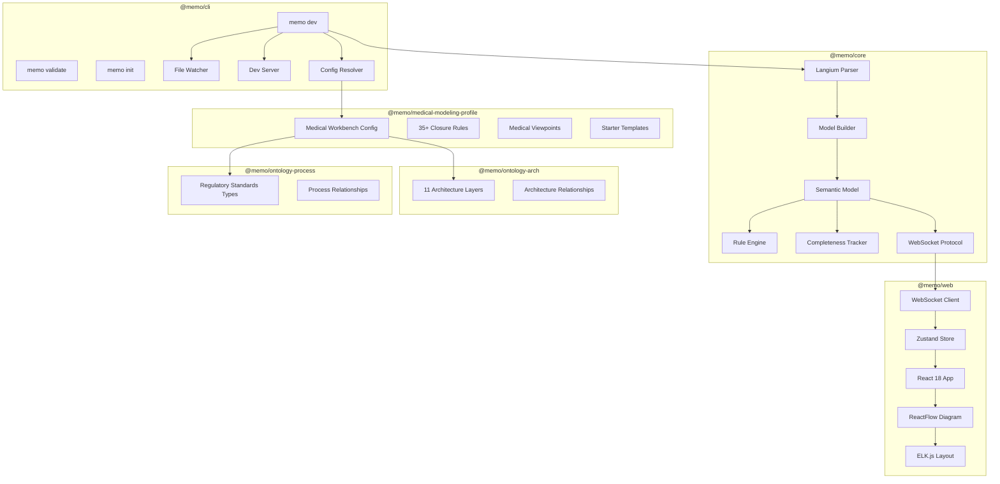

# Architecture Overview

MEMO is a monorepo containing multiple packages that form a layered architecture from ontology definition through parsing, validation, and visualization.

## System Context


```mermaid
graph LR
    Dev[Developer] -->|writes| SysML[.sysml files]
    Dev -->|configures| Config[memo.config.yaml]
    Dev -->|runs| CLI[memo CLI]
    CLI -->|parses| SysML
    CLI -->|loads| Config
    CLI -->|serves| Web[Web App]
    Web -->|displays| Diagram[Interactive Diagram]
    Dev -->|views| Diagram
```

## Package Architecture


```mermaid
graph TD
    subgraph "@memo/core"
        Parser[Langium Parser]
        Builder[Model Builder]
        Validator[Rule Engine]
        Completeness[Completeness Tracker]
        Semantic[Semantic Model]
        Protocol[WebSocket Protocol]
    end

    subgraph "@memo/ontology-arch"
        ArchTypes[11 Architecture Layers]
        ArchRels[Architecture Relationships]
    end

    subgraph "@memo/ontology-process"
        ProcTypes[Regulatory Standards Types]
        ProcRels[Process Relationships]
    end

    subgraph "@memo/medical-modeling-profile"
        MedConfig[Medical Workbench Config]
        Rules[35+ Closure Rules]
        Viewpoints[Medical Viewpoints]
        Templates[Starter Templates]
    end

    subgraph "@memo/cli"
        DevCmd[memo dev]
        ValidateCmd[memo validate]
        InitCmd[memo init]
        FileWatcher[File Watcher]
        DevServer[Dev Server]
        ConfigResolver[Config Resolver]
    end

    subgraph "@memo/web"
        React[React 18 App]
        ReactFlow[ReactFlow Diagram]
        ELK[ELK.js Layout]
        Zustand[Zustand Store]
        WS[WebSocket Client]
    end

    Parser --> Builder
    Builder --> Semantic
    Semantic --> Validator
    Semantic --> Completeness
    Semantic --> Protocol

    DevCmd --> Parser
    DevCmd --> ConfigResolver
    DevCmd --> DevServer
    DevCmd --> FileWatcher
    ConfigResolver --> MedConfig
    MedConfig --> ArchTypes
    MedConfig --> ProcTypes

    Protocol --> WS
    WS --> Zustand
    Zustand --> React
    React --> ReactFlow
    ReactFlow --> ELK
```

## Package Responsibilities

| Package | Role | Key Exports |
|---|---|---|
| `@memo/core` | Parser, model, validation | `parseFiles`, `buildMemoModel`, `modelToDTO`, `evaluateClosureRules`, `computeCompleteness` |
| `@memo/ontology-arch` | Architecture ontology | 11 ISO 42010 layers (operational→functional→logical→software→hardware→behavioral→verification→safety→security→privacy) + ROS extension |
| `@memo/ontology-process` | Process ontology | Regulated standard artifacts (ISO 14971, IEC 62304, ISO 13485, IEC 60601, ISO 14155, ISO 27001/27701, FDA 21 CFR 820, EU MDR) |
| `@memo/medical-modeling-profile` | Medical modeling profile | `memo.package.yaml` with 35+ closure rules, viewpoints, and starter templates (extends both ontology packages) |
| `@memo/cli` | CLI commands | `memo dev`, `memo validate`, `memo init` |
| `@memo/web` | Browser UI | React app with diagram, sidebar, completeness |

## Dependency Graph

```
@memo/web ──> @memo/core
@memo/cli ──> @memo/core
@memo/cli ──> @memo/ontology-arch
@memo/cli ──> @memo/ontology-process
@memo/medical-modeling-profile extends [@memo/ontology-arch, @memo/ontology-process]
@memo/core (standalone)
@memo/ontology-arch (standalone)
@memo/ontology-process extends @memo/ontology-arch
```

The `@memo/core` package has zero runtime dependencies on domain packages. Domain knowledge flows through `memo.config.yaml` at runtime.
