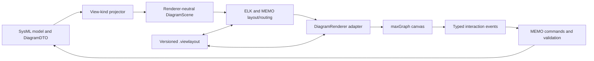

# ADR-1-20: Migrate Diagram Rendering to maxGraph

**Status:** Proposed
**Date:** 2026-07-13
**Owners:** Web architecture and diagram rendering
**Scope:** `@memo/web` interactive graph diagrams; no change to SysML semantics
**Related:** [ADR-1-21 modular capability-provider architecture](ADR-1-21-modular-capability-provider-architecture.md)

---

## Executive summary

Adopt [`@maxgraph/core`](https://github.com/maxGraph/maxGraph) behind a MEMO-owned
renderer adapter, then migrate diagram kinds incrementally from React Flow.
maxGraph is the maintained, TypeScript successor to the archived mxGraph engine
that underpins draw.io. It supplies the mature graph primitives MEMO needs:
ports, hierarchical cells, orthogonal connectors, bend editing, folding,
selection, guides, undo, and SVG rendering.

Do **not** embed or fork the complete draw.io editor, adopt the archived mxGraph
package, or make mxGraph XML the MEMO data model. The SysML model remains the
semantic source of truth and `.viewlayout` remains the presentation source of
truth. Keep ELK during the first migration because it already implements MEMO's
specialized automatic layouts; evaluate maxGraph layouts only after rendering
and interaction parity is proven.

This proposal is intentionally a gated migration, not an immediate dependency
swap. A time-boxed spike and screenshot/performance gates must pass before the
team accepts this ADR and commits to full cutover.

## Implementation status (2026-07-13)

The Phase 0 spike and the flag boundary are implemented in `@memo/web`:

- Renderer provider layer at `packages/web/src/diagram/` (`renderer-provider.ts`,
  `renderer-registry.ts`, `renderer-selection.ts`, `renderers.ts`) mirroring the
  layout-provider architecture. Selection precedence: `?renderer=` URL param →
  `localStorage` → `VITE_MEMO_DIAGRAM_RENDERER` → ReactFlow default, with an
  on-canvas runtime switcher (`views/DiagramSurface.tsx`).
- `memo.renderer.maxgraph` (`renderers/maxgraph/`) renders every canvas view
  kind through the same template layout pipeline via a pure ReactFlow-shape →
  scene adapter (`scene.ts`), with pan/zoom/fit, selection → inspector, drag
  persisted to the sidecar, and SVG export. Read-mostly: authoring stays on
  ReactFlow, per constraint 8.
- ELK and `.viewlayout` remain authoritative; no draw.io assets are used.

Phase 1 (templates emit `DiagramScene` natively; `DiagramCanvas` split) has not
started — the adapter converts at the maxGraph boundary instead. See
[../../architecture/reference/diagram-renderers.md](../../architecture/reference/diagram-renderers.md).

## Why maxGraph, not mxGraph or draw.io

- The public mxGraph repository was archived in 2020. maxGraph describes itself
  as its actively maintained successor and preserves mxGraph concepts and XML
  compatibility while adding native TypeScript and modular imports.
- The complete draw.io application is an end-user diagram/whiteboard product,
  not a small renderer SDK. Embedding it would duplicate MEMO's toolbar,
  persistence, commands, selection model, and domain validation.
- maxGraph is framework-agnostic, has no runtime third-party dependencies, and
  offers a `BaseGraph` entry point for selective registration and tree-shaking.
- Both maxGraph and draw.io are Apache-2.0 licensed, but draw.io's stencil and
  icon assets carry additional usage terms. MEMO should use its own shapes and
  icons and depend only on `@maxgraph/core` unless legal review approves more.

Primary references:

- [maxGraph introduction and feature inventory](https://maxgraph.github.io/maxGraph/docs/intro/)
- [maxGraph `Graph` and `BaseGraph` architecture](https://maxgraph.github.io/maxGraph/docs/usage/graph/)
- [Archived mxGraph repository](https://github.com/jgraph/mxgraph)
- [draw.io source, scope, license, and trademark terms](https://github.com/jgraph/drawio)

## Current engine review

MEMO currently uses React Flow for rendering and interaction and ELK.js plus
custom algorithms for layout and routing.

### What is working well

- The semantic model (`MemoModelDTO` and `DiagramDTO`) is independent from the
  canvas library.
- The persisted `DiagramLayout` contract is mostly renderer-neutral: node
  geometry, port positions, edge styles and bends, viewport, snapping, and
  auto-layout state are stored without React Flow objects.
- Each SysML view kind already has a template/layout function. ELK runs in a
  worker and layout jobs are bounded and protected against stale completion.
- Grid, browser, and deferred geometry views do not require a graph renderer.
- Existing benchmark rules and a 1440x900 screenshot gate define a useful
  visual acceptance baseline.

### Main architectural liabilities

- `DiagramCanvas.tsx` is a 2,191-line component combining projection, layout
  dispatch, rendering, interactions, persistence, commands, overlays, and
  view-specific controls. A direct renderer replacement here would be risky.
- Sixteen web source files import `@xyflow/react`. Layout/template functions
  return React Flow `Node` and `Edge` types, so renderer details leak upstream
  into otherwise reusable projection and layout code.
- Nine custom React node/edge component files rely on handles, resizers,
  renderer hooks, and HTML-in-node behavior. These must become maxGraph shapes,
  overlays, label renderers, or external React overlays.
- The ontology decomposition surface is a second, independent React Flow canvas
  and must be migrated before `@xyflow/react` can be removed.
- Current tests exercise template projection/layout heavily but do not provide
  enough canvas interaction, persistence round-trip, accessibility, visual, or
  performance coverage for an engine replacement.
- There are two routing authorities today: ELK/custom orthogonal routing and
  React Flow edge rendering. Adding maxGraph routing without an explicit
  ownership rule would create unstable bends and save/reload drift.

## Decision

If the spike gates pass, MEMO will use maxGraph as the graph rendering and
interaction engine behind a renderer-neutral boundary.

The following constraints are part of the decision:

1. **MEMO owns the canonical intermediate representation.** Projection and
   layout functions produce `DiagramScene`, not maxGraph or React Flow cells.
2. **SysML remains authoritative.** Renderer edits emit typed MEMO commands;
   cells never become an independent semantic model.
3. **`.viewlayout` remains authoritative for presentation.** Extend it only
   with versioned, renderer-neutral fields when required. Do not persist opaque
   maxGraph state.
4. **ELK remains the initial automatic-layout authority.** maxGraph renders the
   resulting geometry and owns manual interaction. Its layout algorithms can
   replace individual ELK paths only through later benchmarked decisions.
5. **One routing authority per edge state.** Automatic edges use the selected
   layout/router; once a user edits bends, saved route points win until reset or
   endpoint identity changes.
6. **React owns application chrome; maxGraph owns the canvas DOM.** The adapter
   integrates an imperative graph lifecycle into React and publishes typed
   events. It must not mirror every pointer move into React state.
7. **No draw.io application dependency.** Optional `.drawio` import/export is a
   separate interoperability feature and is not required for renderer cutover.
8. **Cutover is reversible until parity is accepted.** Both renderers run behind
   a development feature flag during migration; production uses one renderer
   per canvas, never two overlapping interaction layers.

## Target architecture



### Proposed internal contracts

Create a renderer-neutral module such as `packages/web/src/diagram/`:

```ts
interface DiagramScene {
  nodes: SceneNode[];
  edges: SceneEdge[];
  groups: SceneGroup[];
  viewport?: SceneViewport;
}

interface DiagramRenderer {
  mount(container: HTMLElement): void;
  render(scene: DiagramScene): void;
  fit(options?: FitOptions): void;
  focus(elementId: string): void;
  dispose(): void;
  subscribe(listener: (event: DiagramEvent) => void): () => void;
}
```

`SceneNode` and `SceneEdge` carry stable IDs, semantic kind, geometry, ports,
labels/compartments, style tokens, hierarchy, and route points. They must not
contain React elements, callbacks, maxGraph cells, or renderer-specific style
strings. Event callbacks currently embedded in node/edge `data` move to the
typed event channel.

### Responsibility mapping

| Current responsibility | Target owner |
| --- | --- |
| Model/viewpoint filtering | Existing MEMO projector/template layer |
| Node/edge intermediate types | `DiagramScene` |
| Initial layout | ELK and existing MEMO algorithms |
| Automatic edge routing | Existing router initially; benchmark per view kind |
| SVG drawing, hit testing, selection | maxGraph adapter |
| Drag, resize, connect, bend editing | maxGraph plugins/handlers |
| Model validation and allowed relationships | MEMO command layer |
| Toolbar, palette, dialogs, properties | React application UI |
| Undo/redo | One MEMO command history coordinating semantic and visual edits |
| Saved geometry and viewport | Existing versioned `.viewlayout` sidecar |
| Optional `.drawio` exchange | Future import/export adapter |

## Migration plan

### Phase 0 — Baseline and feasibility spike

Time-box the spike before accepting this ADR.

- Capture representative 1440x900 baselines for general graph, decomposition,
  interconnection with ports, action flow with swimlanes, state transition,
  sequence, and ontology decomposition.
- Record node/edge counts, first-render time, relayout time, pan/zoom frame
  behavior, bundle size, and layout save/reload fidelity on small, medium, and
  largest available models.
- Build a standalone maxGraph spike using `BaseGraph` where practical. Render a
  general diagram plus the hardest case: nested interconnection nodes with
  boundary ports and editable orthogonal bends.
- Prove React lifecycle cleanup, resize handling, theme tokens, keyboard focus,
  context menus, selection synchronization, and a `.viewlayout` round trip.
- Produce a dependency/license inventory. Do not copy draw.io stencil assets.

**Exit gate:** no blocker in nested groups, ports, edge labels, bend editing,
SVG export, browser support, or cleanup; visual score is at least 4/5 in every
existing benchmark category; medium-model interaction remains responsive; and
the production bundle increase is explicitly accepted.

### Phase 1 — Extract renderer-neutral scene and controller

- Define `DiagramScene`, `DiagramEvent`, and `DiagramRenderer` with unit tests.
- Convert template/layout outputs from `@xyflow/react` types to scene types.
- Split `DiagramCanvas` into projection/layout controller, persistence/command
  controller, React chrome, and renderer host.
- Add adapters between `DiagramScene` and the existing React Flow renderer so
  behavior stays unchanged while the boundary is validated.
- Add schema/version handling and round-trip tests for `.viewlayout`.

**Exit gate:** the React Flow UI has feature parity, templates no longer import
`@xyflow/react`, and renderer-independent tests cover all graph view kinds.

### Phase 2 — Implement the maxGraph adapter

- Mount one graph instance per host and dispose all listeners/plugins on
  unmount. Use batched model updates and stable element-ID-to-cell maps.
- Register only required shapes, markers, perimeters, edge styles, and plugins.
- Implement design-token styles and custom SysML shapes/compartments without
  importing draw.io application assets.
- Translate maxGraph events into typed MEMO events. Suppress feedback loops
  while applying model/scene updates.
- Implement viewport restore, fit, grid/snap, selection/focus, minimap decision,
  resize, connect, inline label editing, grouping/folding, and manual bends.
- Keep quick-create, relationship picker, property panels, and context menus in
  React, positioned from adapter-provided canvas coordinates.

**Exit gate:** general and interconnection diagrams pass interaction,
persistence, visual, cleanup, and performance tests behind the feature flag.

### Phase 3 — Migrate view kinds in risk order

Migrate one vertical slice at a time:

1. General graph and simple decomposition.
2. State transition and action flow.
3. Hierarchical decomposition/FBS and sequence.
4. Interconnection, including nested parts, boundary ports, route handles, and
   flow styling.
5. Ontology decomposition, the independent second canvas.

Grid, browser, and the deferred geometry view remain unchanged. Each slice must
pass the same renderer-neutral contract suite and screenshot gate before the
next begins.

### Phase 4 — Interaction and operational hardening

- Unify semantic and presentation changes under one command history so undo
  does not diverge between React, maxGraph, and the model store.
- Add Playwright-style end-to-end coverage for create/connect/edit/delete,
  drag/resize/bend, undo/redo, keyboard navigation, save/reload, diagram switch,
  and text/visual split synchronization.
- Add leak tests for repeated mount/unmount and fast diagram switching.
- Test supported browsers, high-DPI displays, reduced motion, screen-reader
  labeling/fallbacks, and large models.
- Verify WebSocket layout updates remain debounced and backward-compatible.

### Phase 5 — Cutover and cleanup

- Enable maxGraph by default only after every graph view kind passes parity.
- Keep the React Flow fallback for one release or an agreed stabilization
  window; log renderer failures without sending model content.
- Remove the flag, React Flow adapters, custom React Flow node components,
  styles, and `@xyflow/react` only after the rollback window closes.
- Re-measure bundle/performance and update runtime data-flow and benchmark docs.
- Consider maxGraph layout adoption and `.drawio` import/export as separate ADRs
  based on measured value, not as hidden scope in this migration.

## Pros and cons

### Pros

- Mature graph editing primitives closely match the requested draw.io-quality
  interactions: ports, folding, guides, orthogonal edges, bends, labels,
  grouping, selection, and undo support.
- SVG-centric rendering and a rich style/shape system are a better fit for
  dense engineering diagrams than assembling many React DOM nodes.
- The maxGraph cell model naturally represents compound SysML structures,
  boundary ports, swimlanes, and drill-down.
- TypeScript, modular registration, zero runtime dependencies, and framework
  independence fit the current Vite/React application.
- A renderer-neutral scene reduces future lock-in and makes projection/layout
  logic testable without a browser canvas.
- mxGraph XML compatibility creates a plausible later path to `.drawio`
  exchange without making that format canonical.

### Cons

- This is a substantial rewrite, not a package rename. Existing React node
  components, hooks, edge labels, and event callbacks cannot be reused directly.
- maxGraph is imperative and stateful; careful lifecycle and synchronization
  code is required inside React.
- maxGraph's API and documentation are less idiomatic for React developers than
  React Flow, increasing onboarding and maintenance cost.
- Rich built-ins can increase bundle size unless `BaseGraph` and selective
  registration work for MEMO's feature set.
- Accessibility must be designed and tested explicitly for an SVG/canvas-like
  editor; current behavior cannot be assumed to carry over.
- Running two renderers during migration temporarily increases code, tests,
  dependency surface, and defect triage complexity.
- maxGraph's automatic layouts will not automatically match MEMO's current ELK
  results, so keeping both libraries initially limits dependency reduction.

## Risks and mitigations

| Risk | Mitigation |
| --- | --- |
| Model and graph state diverge | One-way scene rendering plus typed commands; never treat cells as canonical |
| Layouts shift or saved bends drift | Preserve `.viewlayout`; define routing ownership; add golden round-trip fixtures |
| React/maxGraph feedback loops | Batch graph writes, tag adapter-originated changes, and suppress echo events |
| Stale graph instances/listeners | Single host lifecycle, explicit `dispose`, and repeated-switch leak tests |
| Feature gap appears late | Spike the hardest interconnection case first, not only a simple flowchart |
| Bundle growth | Measure before/after, use lazy loading and `BaseGraph`, set an accepted budget |
| Visual regression | Existing 4/5 screenshot gate for every migrated view kind |
| Accessibility regression | Keyboard/focus semantics and equivalent textual/table access in exit criteria |
| Upstream/project risk | Pin exact versions, maintain adapter isolation, review release/security cadence |
| License/trademark misuse | Depend on Apache-2.0 core only; use MEMO assets; do not brand as draw.io |

## Acceptance criteria for final cutover

- All seven rendered graph view kinds and ontology decomposition pass semantic,
  interaction, visual, performance, and save/reload parity tests.
- Grid, browser, text/split mode, and the deferred geometry placeholder remain
  unaffected.
- No template or application component imports renderer-specific cell types;
  renderer imports are confined to adapter directories.
- Existing `.viewlayout` files open without migration loss, and files saved by
  the new renderer remain readable by the fallback during the rollback window.
- Supported browser and accessibility checks pass.
- Production bundle and largest-model performance are measured and accepted.
- `@xyflow/react` and its CSS can be removed without changing domain logic.

## Rollback strategy

Before final cleanup, switching the development/production configuration back
to the React Flow adapter restores the prior renderer. The rollback works
because both adapters consume `DiagramScene` and persist the same versioned
`.viewlayout` contract. Any sidecar extension introduced during migration must
be optional to older adapters until the rollback window ends.

After React Flow removal, rollback means reverting the cutover commit(s), not
converting maxGraph XML, because opaque maxGraph state is never persisted.

## Open decisions to resolve in the spike

- Whether `BaseGraph` supports every required interaction with acceptable setup
  cost, or the full `Graph` class is justified.
- Whether edge routing remains entirely in MEMO/ELK or selected view kinds gain
  maxGraph routing after benchmark comparison.
- Whether the current React overlays are sufficient for rich node content or a
  custom SVG/HTML label strategy is needed.
- The explicit bundle-size and interaction-latency budgets for acceptance.
- The accessibility contract for keyboard graph navigation and nonvisual
  equivalents.
- Whether `.drawio` export has enough user value to plan after cutover.

## Consequences if accepted

- Diagram work first targets the renderer-neutral scene and controller split;
  new React Flow-specific features are avoided during migration.
- `@maxgraph/core` and `@xyflow/react` coexist temporarily behind adapters.
- ELK stays in the product until separately superseded.
- GitLab must carry the executable epics/stories and wave sequencing; this ADR
  owns the architectural boundaries, gates, and rationale rather than roadmap
  status.
