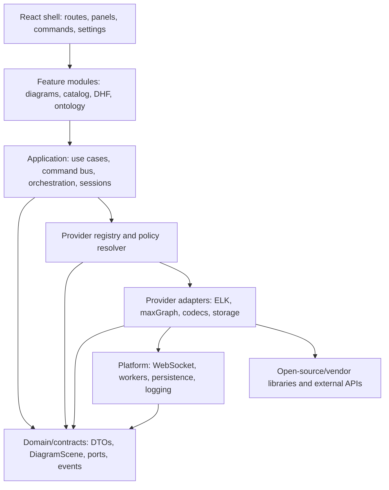

# ADR-1-21: Modular Capability-Provider Architecture for the Web App

**Status:** Proposed
**Date:** 2026-07-13
**Owners:** Web and platform architecture
**Scope:** `@memo/architect` application boundaries, replaceable technologies, and user-selectable providers
**Related:** [ADR-1-20 maxGraph renderer migration](ADR-1-20-maxgraph-diagram-renderer.md)

---

## Executive summary

Refactor the MEMO web app into a layered application with stable, vendor-neutral
capability contracts. Rendering, layout, routing, import/export, analysis,
validation, storage, and selected UI contributions become providers registered
through one typed catalog. The React shell and domain use cases depend on ports,
not on React Flow, ELK, maxGraph, WebSocket details, or third-party APIs.

Layout is the first proving capability:

- ELK becomes the built-in default `LayoutProvider`, not a directly imported
  global utility.
- MEMO may ship additional providers such as Dagre or manual/fixed layout.
- A trusted user or organization can install a package that implements the same
  contract, configure its options from a schema, and select it globally or for
  one diagram.
- Every provider receives a renderer-neutral, serializable scene and returns
  geometry plus diagnostics. It cannot mutate SysML semantics.
- Provider identity, version, options, seed, and result provenance are recorded
  so regulated outputs remain reproducible.

The same architecture lets the team replace React Flow with maxGraph, add a
different router, upgrade a storage integration, or test a new exporter without
rewriting application features.

## Implementation status

The first vertical slice is implemented on 2026-07-13:

- A vendor-neutral, versioned `LayoutProvider` contract and explicit registry
  isolate layout engines from canvas and template code.
- Built-in ELK, Dagre, and fixed-position providers declare capabilities and
  reject unsupported graph shapes before execution.
- Provider results are validated so an adapter cannot change node identities or
  return non-finite coordinates.
- Compatible automatic providers are selectable per diagram. The provider ID,
  version, and contract version are persisted in the existing `.viewlayout`
  sidecar without coupling the persistence layer to a specific engine.
- Contract, registry, Dagre, fixed-position, and persistence behavior have unit
  coverage.

This slice proves the provider boundary; it does not yet implement the maxGraph
renderer adapter, external provider package loading, manifest-based catalog,
configuration schemas, or sandboxed third-party execution. Those remain gated
follow-on phases of this proposed decision.

## Motivation

The immediate request is better diagram rendering, but replacing one vendor
inside the current structure would leave the next replacement just as costly.
The desired property is not “maxGraph everywhere”; it is **replaceability by
contract**.

The architecture must support three distinct needs:

1. **Platform evolution:** maintainers can upgrade or replace libraries behind
   adapters without changing domain features.
2. **Product configuration:** a project or user can choose among installed
   providers and presets, subject to diagram requirements and policy.
3. **Extension development:** trusted third parties can implement supported
   capabilities using a small SDK and conformance suite instead of importing
   application internals.

This is especially important for MEMO because its outputs may participate in
design reviews and regulated evidence. Extensibility must preserve semantic
authority, determinism, traceability, and safe failure.

## draw.io architecture review

draw.io is useful as an architectural reference, not as code to copy wholesale.
Its current source shows several separations:

- The reusable graph-editor layer separates `Graph`, `Editor`, `EditorUi`,
  `Actions`, `Menus`, `Toolbar`, `Sidebar`, `Shapes`, and `Format` concerns in
  the [`grapheditor` source tree](https://github.com/jgraph/drawio/tree/dev/src/main/webapp/js/grapheditor).
- `Editor` owns the graph, model-change observation, modified state, and undo
  manager, while `EditorUi` composes actions, menus, panels, selection state,
  and the graph container. See the current
  [`Editor` source](https://raw.githubusercontent.com/jgraph/drawio/dev/src/main/webapp/js/grapheditor/Editor.js)
  and [`EditorUi` source](https://raw.githubusercontent.com/jgraph/drawio/dev/src/main/webapp/js/grapheditor/EditorUi.js).
- The application-specific `diagramly` layer contains integrations and optional
  technology modules separately: storage clients/files for Drive, GitHub,
  GitLab, OneDrive, Dropbox and local files; import codecs; `ElkLayout`;
  `LibavoidRouting`; settings; collaboration; viewer and embed surfaces. The
  [`diagramly` source tree](https://github.com/jgraph/drawio/tree/dev/src/main/webapp/js/diagramly)
  makes these boundaries visible.
- Optional features live in a separate
  [`plugins` directory](https://github.com/jgraph/drawio/tree/dev/src/main/webapp/plugins),
  including layouts and application commands.
- Modern automatic-layout dialogs use ELK, while legacy layouts remain
  available. This confirms that renderer and layout engine are independent
  choices. See draw.io's
  [2026 ELK layout announcement](https://www.drawio.com/blog/auto-layouts/).

### Lessons to adopt

- Keep the graph/scene model independent from the editor shell.
- Treat actions/commands as first-class objects that menus, toolbars, shortcuts,
  and plugins can reference by ID.
- Separate layout, routing, codecs, persistence, and external integrations from
  rendering.
- Support multiple providers for the same capability and resolve them from
  configuration.
- Keep application-specific integration code outside reusable diagram logic.
- Make lifecycle and undo management explicit.

### Lessons not to copy

draw.io grew from a pre-module JavaScript architecture and frequently extends
behavior through globals and prototype overrides. That is powerful but makes
dependency ownership, typing, testing, and upgrade impact harder to reason
about. MEMO should instead use:

- TypeScript interfaces and serializable contracts;
- constructor/factory injection rather than global singletons;
- explicit provider registration rather than prototype mutation;
- scoped workspace and diagram sessions;
- isolated workers for compute providers;
- declared permissions, schemas, and compatibility versions;
- contract tests for every provider.

## Current MEMO assessment

### Useful foundations

- The semantic model is already outside the web renderer in `@memo/tools`.
- Kind, relationship, rule, and plugin registries establish a familiar registry
  pattern.
- The existing plugin system supports export, analysis, validation, and
  generation on the CLI side.
- `DiagramDTO` and `.viewlayout` are substantially independent from the canvas
  library.
- Layout templates already separate diagram-kind projection from much of the
  application shell.
- ELK already runs through a bounded worker-backed wrapper.

### Gaps to address

- `@memo/architect` is organized mainly by React component type, not dependency
  direction. Views import stores, WebSocket functions, vendor types, layout
  algorithms, and domain operations directly.
- `DiagramCanvas.tsx` combines application use cases, layout orchestration,
  persistence, command handling, view-kind policy, and rendering.
- Sixteen source files import `@xyflow/react`; template/layout functions expose
  vendor `Node` and `Edge` types.
- ELK is a module-level singleton and layout authority is selected through
  branches rather than a provider registry.
- The web app has no real provider catalog. `ExtensionBrowser` currently shows
  hard-coded/inferred ontology entries rather than installed capabilities.
- The CLI plugin API is not yet a stable cross-runtime SDK. Its runtime types and
  developer guide disagree in places (`entrypoint` versus `entry`, and
  `analyse`/`validate` versus a documented generic `run`).
- The existing plugin manifest permits only one plugin type and lacks a
  capability list, contract version, runtime, permissions, configuration JSON
  Schema, integrity metadata, and compatibility range.
- Plugins receive a broad internal context. Browser extensions should receive
  least-privilege, serializable inputs instead.
- Provider selection, version pinning, provenance, health, and fallback policy
  are not represented in project or diagram state.

## Decision

If accepted, the web app will follow these rules:

1. **Dependencies point inward.** The shell and adapters depend on application
   and domain contracts; domain/application code never imports infrastructure
   or vendor packages.
2. **Every replaceable technology is behind a port.** Vendor code is confined
   to a provider adapter and its tests.
3. **Providers declare capabilities.** One package may contribute one or more
   typed capabilities through a versioned manifest.
4. **The registry is scoped.** A platform registry owns installed descriptors;
   each workspace/diagram session resolves its own provider instances.
5. **Commands are the mutation boundary.** Renderers and UI contributions emit
   typed intents; application handlers validate and mutate semantic or
   presentation state.
6. **Serialized data is vendor-neutral.** SysML is semantic truth,
   `.viewlayout` is presentation truth, and neither stores opaque vendor
   objects.
7. **Provider choice is explicit and reproducible.** IDs, versions, options,
   seeds, and input/result hashes are available in provenance.
8. **User code is trusted only by explicit installation.** No arbitrary remote
   JavaScript is fetched or evaluated from a diagram or catalog entry.
9. **Capability support is negotiated.** A provider may run only when it
   supports the scene features and policy required by the diagram.
10. **Fallback is defined per capability.** Failure is bounded, observable, and
    never silently changes semantic content.

## Target layers



### Layer responsibilities

| Layer | Owns | Must not own/import |
| --- | --- | --- |
| Domain/contracts | Immutable scene types, IDs, commands, events, capability ports, errors | React, Zustand, WebSocket, maxGraph, React Flow, ELK |
| Application | Use cases, command handlers, undo transactions, provider resolution, orchestration | Vendor APIs or browser DOM |
| Features | Diagram/catalog/DHF/ontology presentation models and React components | Direct vendor or network calls |
| Shell | Routes, workbench chrome, command surfaces, provider settings/catalog UI | Domain mutation logic |
| Providers/adapters | One implementation of one or more capability ports | Cross-feature policy or canonical state |
| Platform | WebSocket transport, workers, persistence, logging, security policy | Feature-specific UI |

### Initial source layout

Begin inside `packages/web/src` so architecture can stabilize before adding
package-release overhead:

```text
packages/web/src/
  domain/                 vendor-neutral contracts and value types
  application/            use cases, command bus, sessions, provider resolver
  features/
    diagrams/
    catalog/
    dhf/
    ontology/
  providers/
    layout-elk/
    layout-dagre/
    renderer-reactflow/
    renderer-maxgraph/
  platform/
    websocket/
    workers/
    persistence/
  shell/                  routes, workbench, menus, settings, provider catalog
```

Once dependency rules and contracts are stable, extract only independently
versionable units:

```text
packages/diagram-contracts/       @memo/diagram-contracts
packages/diagram-core/            @memo/diagram-core
packages/provider-layout-elk/     @memo/provider-layout-elk
packages/provider-renderer-maxgraph/ @memo/provider-renderer-maxgraph
packages/web/                     @memo/architect shell and features
```

Do not start with many packages. Physical extraction follows proven logical
boundaries; it does not create them.

## Capability model

### Initial capability types

| Capability | Purpose | Example providers |
| --- | --- | --- |
| `diagram.renderer` | Draw and interact with a `DiagramScene` | React Flow, maxGraph, Sprotty |
| `diagram.layout` | Compute node/group/port geometry | ELK, Dagre, WebCola, fixed/manual |
| `diagram.router` | Compute or repair edge routes | MEMO orthogonal, ELK routes, maxGraph styles, libavoid |
| `diagram.codec.import` | Convert an external format to an import IR | draw.io XML, GraphML, CSV |
| `diagram.codec.export` | Export scene/model projections | SVG, draw.io XML, GraphML, PNG/PDF |
| `model.analysis` | Read-only model analysis | impact, DSM, custom reliability analysis |
| `model.validation` | Produce typed violations | built-in rules, organization rules |
| `document.export` | Render document IR | HTML, DOCX, PDF, Markdown |
| `storage` | Read/write project or artifact resources | local/CLI, future Git/Drive providers |
| `ui.command` | Add a command handled by existing surfaces | run layout, export, focus mode |
| `ui.panel` | Contribute a bounded panel using approved host APIs | analysis results, provider settings |

Renderer, layout, and router remain separate capabilities. A package may
implement more than one, but the registry exposes and resolves them separately.

### Provider descriptor

```ts
type CapabilityId =
  | 'diagram.renderer'
  | 'diagram.layout'
  | 'diagram.router'
  | 'diagram.codec.import'
  | 'diagram.codec.export'
  | 'model.analysis'
  | 'model.validation'
  | 'document.export'
  | 'storage'
  | 'ui.command'
  | 'ui.panel';

interface ProviderDescriptor {
  id: string;                    // reverse-DNS or package-qualified, stable
  name: string;
  version: string;               // exact implementation version
  capability: CapabilityId;
  contractVersion: string;       // MEMO port version, independent of package
  runtime: 'browser' | 'worker' | 'server';
  license: string;
  features: string[];
  configSchema?: JsonSchema;
  permissions?: ProviderPermission[];
}
```

Descriptors are data. Provider factories and implementations are code. The
catalog can inspect descriptors without executing provider code.

### Registry and resolution

Use explicit registration during trusted application/plugin startup:

```ts
interface CapabilityRegistry {
  register<T>(descriptor: ProviderDescriptor, factory: ProviderFactory<T>): void;
  list(capability?: CapabilityId): ProviderDescriptor[];
  resolve<T>(request: ProviderRequest): Promise<ProviderSession<T>>;
}
```

Resolution checks, in order:

1. provider is installed, enabled, and allowed by organization policy;
2. contract version is compatible;
3. runtime and declared permissions are available;
4. provider supports the requested scene/model features;
5. configuration validates against its JSON Schema;
6. the provider passes its health check or a defined fallback is selected.

No feature imports or searches a registry global directly. A scoped session
receives the resolved port through application composition.

## Layout-provider reference design

Layout is the first end-to-end implementation because it is computational,
already has multiple viable engines, and has a clean geometry-only boundary.

### Contract

```ts
interface LayoutProvider {
  readonly descriptor: ProviderDescriptor;

  supports(request: LayoutSupportRequest): SupportResult;

  layout(
    request: LayoutRequest,
    context: LayoutExecutionContext,
  ): Promise<LayoutResult>;

  dispose?(): Promise<void> | void;
}

interface LayoutRequest {
  scene: Readonly<DiagramScene>;
  previous?: Readonly<LayoutSnapshot>;
  constraints: LayoutConstraint[];
  direction?: 'right' | 'down' | 'left' | 'up';
  preset?: string;
  options: Record<string, unknown>;
  seed?: number;
}

interface LayoutExecutionContext {
  signal: AbortSignal;
  deadlineMs: number;
  reportProgress(progress: LayoutProgress): void;
}

interface LayoutResult {
  geometry: LayoutSnapshot;
  diagnostics: LayoutDiagnostic[];
  provenance: {
    providerId: string;
    providerVersion: string;
    contractVersion: string;
    optionsHash: string;
    inputHash: string;
    seed?: number;
    durationMs: number;
  };
}
```

The scene contains IDs, hierarchy, measured dimensions, ports, edges, and
layout hints. The result contains positions, sizes where explicitly allowed,
port positions, and route candidates. It cannot add/delete semantic elements,
change relationships, or return renderer objects.

### Required feature vocabulary

Providers advertise and negotiate at least:

- `flat-graph`
- `compound-graph`
- `explicit-ports`
- `port-constraints`
- `orthogonal-routes`
- `edge-labels`
- `swimlanes`
- `incremental-layout`
- `fixed-nodes`
- `deterministic-seed`
- `cancellable`
- `worker-runtime`

For example, an interconnection diagram requiring compound nodes and explicit
ports must not be offered a provider that supports only flat DAGs.

### Provider choice and persistence

Resolution precedence is:

1. saved per-diagram selection;
2. project/methodology policy;
3. user's workspace preference;
4. built-in view-kind default;
5. safe fixed/manual fallback.

Project configuration may define allowed providers and named presets. The
selected presentation state extends `.viewlayout` with optional, versioned
fields rather than changing `DiagramDTO` semantics:

```yaml
schemaVersion: 2
canvas:
  autoLayout: true
  layout:
    provider: memo.layout.elk
    providerVersion: 0.11.1
    contractVersion: 1
    preset: layered-right
    seed: 1
    options:
      spacing.nodeNode: 40
      spacing.layer: 80
```

The UI offers only compatible installed providers. Choosing one runs a preview;
Apply persists the selection and geometry as one undoable presentation command.
Cancel restores the previous snapshot.

### User-defined layout managers

Support users at three levels:

1. **Custom preset — first release.** A user defines validated options and
   constraints for an installed provider. No code execution is required.
2. **Trusted provider package — second release.** An organization installs a
   pinned npm/local plugin implementing `LayoutProvider`. Browser providers run
   in a dedicated worker; server providers run through the CLI plugin host.
3. **Restricted WASM/worker provider — future.** A capability-limited runtime
   accepts and returns JSON without DOM, network, filesystem, or model-write
   access. Do not promise arbitrary untrusted JavaScript before this sandbox and
   its threat model exist.

An installed custom layout manager appears in the same catalog and layout menu
as built-ins. It must pass the layout conformance kit and declare licenses,
permissions, compatibility, and supported features.

### Execution policy

- Run CPU-heavy browser layouts in a dedicated worker.
- Enforce cancellation and a configured deadline.
- Coalesce rapid diagram switches and ignore stale completions.
- Limit input/output size and validate all returned IDs and finite geometry.
- Preserve the last valid layout on error.
- Show diagnostics and the selected fallback; never silently switch engines.
- Cache by provider/version/input/options/seed hash when safe.
- Record enough provenance to reproduce an accepted review artifact.

## Command and UI composition

Introduce a command registry similar in intent to draw.io's action layer:

```ts
interface AppCommand {
  id: string;
  label: string;
  isVisible(ctx: CommandContext): boolean;
  isEnabled(ctx: CommandContext): boolean;
  execute(ctx: CommandContext, args?: unknown): Promise<CommandResult>;
}
```

Menus, toolbars, keyboard shortcuts, the command palette, and provider
contributions refer to command IDs. They do not duplicate behavior in click
handlers. Commands enter the application command bus, where authorization,
validation, undo transaction boundaries, persistence, and logging are applied.

UI providers may contribute declarative command/menu metadata first. Arbitrary
React components require a stricter host API, isolated error boundary, scoped
state, and explicit permission; they are not part of the first provider phase.

## Open-source technology catalog

This catalog is a candidate inventory, not an instruction to install every
library. Each item still requires a spike, license/SBOM review, maintenance
review, bundle measurement, and conformance testing.

### Diagram renderers/editors

| Candidate | License | Strengths | Main concerns | Recommended role |
| --- | --- | --- | --- | --- |
| [maxGraph](https://maxgraph.github.io/maxGraph/docs/intro/) | Apache-2.0 | Mature mxGraph lineage, SVG, ports, groups, folding, routing, editing, TypeScript, plugins | Imperative integration and learning curve | Preferred interactive engineering renderer spike |
| [React Flow](https://github.com/xyflow/xyflow) | MIT | Current integration, React-native nodes, active project, easy feature UI | Renderer types leak easily; complex compound/port engineering diagrams need substantial custom code | Compatibility adapter and rollback renderer |
| [Sprotty](https://sprotty.org/docs/concepts/architecture-overview/) | EPL-2.0 | Model-driven, SVG, action/command/viewer architecture, Langium integration, extensible DI | Framework adoption is broader than a renderer swap | Strategic alternative if MEMO adopts graphical-language-server patterns |
| [Cytoscape.js](https://js.cytoscape.org/) | MIT | Large graph visualization/analysis, compound nodes, extensive layout extension ecosystem | Less drawing-editor/SysML-document oriented | Analysis and very large network views |
| [JointJS Core](https://github.com/clientIO/joint) | MPL-2.0 | SVG, ports, hierarchy, routers, events, tools | Open-core/commercial boundary and MPL obligations need review | Secondary renderer candidate, not initial default |

### Layout providers

| Candidate | License | Strengths | Limits | Recommended profiles |
| --- | --- | --- | --- | --- |
| [ELK / elkjs](https://github.com/kieler/elkjs) | EPL-2.0 | Layered/compound layouts, ports, many constraints, routes, worker support; already used by MEMO and now draw.io | Large, complex option space, some JS packaging/modularization friction | Default for interconnection, action/state flow, hierarchical engineering views |
| [Dagre](https://github.com/dagrejs/dagre) | MIT | Small, simple, maintained TypeScript DAG layout | Not a full substitute for compound graphs and explicit port constraints | Fast simple directed graphs and trees |
| [WebCola](https://github.com/tgdwyer/WebCola) | MIT | Constraint-based and force-directed layouts; useful alignment/separation constraints | Continuous layout behavior and determinism require care | Exploratory dependency/network diagrams |
| [D3 Force](https://github.com/d3/d3-force) | ISC | Small composable force simulation and collision handling | No engineering-specific hierarchy/ports/orthogonal routing | Exploratory networks only |
| [Graphviz](https://graphviz.org/) | EPL | High-quality batch algorithms and established interchange | Browser use normally needs WASM/service adapter; weak interactive/incremental fit | Export, comparison, and server-side batch layout |
| Fixed/manual MEMO provider | Internal | Deterministic, zero dependency, preserves authored geometry | No automatic improvement | Required safe fallback and manually curated diagrams |

Cytoscape's extension model is a useful reference: layouts are separately
registered extensions, users select a layout by name/options, and the renderer
handles applying positions and lifecycle. See the official
[Cytoscape.js layout and extension documentation](https://js.cytoscape.org/).

### Routing and codecs

| Area | Candidates | Recommendation |
| --- | --- | --- |
| Orthogonal routing | Current MEMO router, ELK edge routes, maxGraph edge styles, libavoid adapter | Keep routing as a separate capability; benchmark by diagram kind and review libavoid licensing before distribution |
| Native persistence | `DiagramDTO`, `DiagramScene`, `.viewlayout` | Remain canonical and vendor-neutral |
| Diagram exchange | draw.io/mxGraph XML, GraphML, SVG | Separate import/export providers; never use exchange XML as semantic truth |
| Raster/document output | Browser SVG pipeline, PNG, PDF providers | Export from a stable scene/snapshot and record provider provenance |

### Catalog evaluation criteria

Every catalog entry records:

- upstream repository and release/version;
- SPDX license and required notices;
- maintenance/release and security posture;
- supported capability contract versions;
- browser/server runtime and bundle cost;
- feature flags such as hierarchy, ports, cancellation, determinism, and worker
  support;
- permissions and data exposure;
- conformance and benchmark results;
- owner, support tier, and deprecation/replacement status.

The catalog is curated metadata about installed or approved packages, not a
remote code marketplace.

## Plugin manifest evolution

Evolve the existing `memo.plugin.yaml` concept rather than creating a second
manifest:

```yaml
apiVersion: memo.dev/v1alpha1
kind: Plugin
metadata:
  id: com.acme.safety-layouts
  name: ACME Safety Layouts
  version: 1.2.0
  license: Apache-2.0
spec:
  memoCompatibility: ">=0.2 <0.3"
  entrypoint: ./dist/index.js
  runtime: worker
  permissions: []
  capabilities:
    - type: diagram.layout
      id: com.acme.layout.safety-tree
      contractVersion: "1"
      features: [compound-graph, fixed-nodes, deterministic-seed]
      configSchema: ./schemas/safety-tree.schema.json
```

Required changes to the current plugin system:

- replace single `type` with a list of capability descriptors;
- standardize `entrypoint` and method naming across types and documentation;
- distinguish package version from contract version;
- declare runtime and permissions;
- validate configuration with JSON Schema;
- add initialize/dispose lifecycle and health checks;
- expose serializable, least-privilege contexts per capability;
- pin installed versions in the project lock/configuration;
- generate the web Provider Catalog from actual manifests.

Backward compatibility can adapt existing export/analysis/validation/generator
plugins into the new capability registry during a deprecation window.

## Provider Catalog user experience

Replace the current static `ExtensionBrowser` concept with a real catalog that
shows:

- Installed, available/approved, disabled, incompatible, and deprecated
  providers.
- Capabilities contributed by each package.
- Version, license, source, support tier, runtime, permissions, and integrity.
- Compatibility with the current MEMO and contract versions.
- Configuration generated from the provider's JSON Schema.
- Benchmark/conformance status and health diagnostics.
- Where the provider is selected: organization policy, project default,
  workspace preference, or diagram override.

Installation remains a CLI/project operation initially. The web catalog may
configure or select installed providers, but it must not silently install code
or bypass project review.

## Dependency and testing rules

### Enforced import rules

- `domain` imports no other web layer.
- `application` imports only `domain` and application modules.
- `features` import application/domain APIs, not provider implementations.
- `providers` import ports plus their vendor package; providers do not import
  each other.
- `platform` implements infrastructure ports and does not import feature UI.
- `shell` is the composition root and the only layer that wires concrete
  providers to ports.

Enforce the rules with ESLint boundaries or an equivalent dependency check in
CI. A folder convention without enforcement will decay.

### Conformance kits

Each capability contract ships reusable tests. The layout kit verifies:

- stable ID preservation;
- finite geometry and valid hierarchy;
- no unintended overlap for declared constraints;
- endpoint and port preservation;
- cancellation/deadline behavior;
- deterministic output when claimed;
- no input mutation;
- valid diagnostics on unsupported features;
- save/reload round trip;
- performance budgets on standard fixtures.

Renderer tests consume the same scenes and command fixtures. This makes a
technology upgrade a provider test exercise rather than an application rewrite.

## Security and trust model

| Trust tier | Runtime | Allowed by default |
| --- | --- | --- |
| Built-in | Browser/worker/server | Contract-scoped access declared by MEMO |
| Organization-approved installed plugin | Prefer worker/server | Explicit manifest permissions and pinned version |
| Local development plugin | Development only | Warning, no production/DHF evidence by default |
| Remote/uninstalled code | None | Never fetched or executed |

Additional controls:

- Content Security Policy and no `eval`/remote module URLs.
- Integrity/lock metadata for installed provider bundles.
- Worker message validation and size/time limits.
- No DOM, network, filesystem, or raw WebSocket access for layout providers.
- Server plugins are trusted code and require the same review as build tools.
- Provider failures are isolated with error boundaries/session teardown.
- Provenance includes provider and configuration but excludes sensitive model
  content from telemetry.

## Migration plan

### Phase 0 — Contracts, boundaries, and baselines

- Accept or revise this ADR and ADR-1-20 together.
- Define `DiagramScene`, command/event contracts, provider descriptors, and
  capability versioning.
- Add dependency-boundary enforcement and architecture tests.
- Baseline bundle size, layout/render performance, screenshot quality, and
  `.viewlayout` fidelity.
- Reconcile existing plugin runtime types with developer documentation.

### Phase 1 — Prove the layout seam

- Wrap current ELK usage as `memo.layout.elk` without behavior changes.
- Add `memo.layout.fixed` as the safe fallback.
- Move view-kind defaults and feature requirements into declarative policy.
- Add the layout registry, resolver, worker host, provenance, and conformance
  kit.
- Add Dagre for simple flat DAGs as the first genuinely interchangeable
  provider.
- Add a layout selector/preview using compatible providers only.

**Gate:** switching ELK to Dagre for a supported general diagram changes no
feature, store, shell, persistence, or renderer code.

### Phase 2 — Renderer and router seams

- Complete the renderer-neutral scene from ADR-1-20.
- Wrap React Flow as the compatibility renderer and maxGraph as the candidate.
- Extract routing into a provider where it is not owned by a layout result.
- Move callbacks embedded in node/edge data to typed events and commands.

**Gate:** renderer selection changes only provider composition; layout and
domain tests run unchanged.

### Phase 3 — Application commands and feature modules

- Split `DiagramCanvas` into session controller, React chrome, renderer host,
  and view-kind feature modules.
- Introduce command registry/bus and one undo transaction model.
- Route menu, toolbar, shortcut, palette, context-menu, and canvas actions
  through command IDs.
- Move WebSocket and persistence calls behind application ports.

### Phase 4 — Unified provider catalog

- Generalize the existing plugin registry and manifest.
- Adapt current CLI plugin types into capability providers.
- Replace hard-coded `ExtensionBrowser` data with installed-manifest data.
- Add provider settings, compatibility, health, license, permissions, and
  selection provenance.

### Phase 5 — Trusted third-party layout SDK

- Publish the layout contract, JSON schemas, worker/server host API, examples,
  and conformance kit.
- Support pinned local/npm packages installed through reviewed CLI workflow.
- Provide a sample custom layout provider and a custom-preset example.
- Document deterministic evidence and support expectations.

### Phase 6 — Package extraction and upgrades

- Extract only contracts/providers that now change independently.
- Run a planned maxGraph cutover if ADR-1-20 gates pass.
- Exercise a provider upgrade and rollback using pinned versions.
- Consider restricted WASM plugins, remote catalog metadata, and other
  capabilities only through separate security/design decisions.

## Acceptance criteria

- Vendor imports are confined to provider/platform adapter directories.
- Features can run with test doubles through application ports.
- ELK and Dagre both pass the same layout contract suite for their declared
  feature sets.
- A sample organization layout provider can be installed, configured, selected,
  previewed, applied, persisted, reproduced, and removed without core edits.
- Unsupported providers are filtered with actionable reasons.
- Provider timeout/failure preserves the last valid diagram and offers an
  explicit fallback.
- React Flow and maxGraph adapters consume the same `DiagramScene` and emit the
  same command events for supported behavior.
- Provider choice and provenance survive save/reload.
- The Provider Catalog is generated from manifests, not hard-coded product
  claims.
- Existing plugins continue through adapters during the deprecation window.
- CI enforces dependency boundaries, contract compatibility, license notices,
  and conformance tests.

## Pros and cons

### Pros

- Future technology upgrades are localized to adapters and contract tests.
- Users can choose fit-for-purpose layouts without forking MEMO.
- Renderer, layout, and routing can evolve independently.
- Domain logic becomes easier to test without React or a browser.
- Explicit commands reduce duplicated UI behavior and unify undo/persistence.
- Provider provenance supports reproducible engineering and review artifacts.
- The existing CLI plugin model gains a coherent path to web capabilities.
- A curated catalog makes licensing, security, compatibility, and support
  visible instead of implicit.

### Cons

- Adds interfaces, registries, descriptors, schemas, and composition code.
- During migration, adapters coexist with legacy direct imports.
- A stable public SDK requires compatibility discipline and documentation.
- Provider configuration and capability negotiation add UX complexity.
- Worker/server isolation complicates debugging and packaging.
- Some vendor-specific features may not fit the common contract and require
  optional extensions or remain adapter-internal.
- Supporting third-party code creates long-term security, support, and
  deprecation obligations.

## Risks and mitigations

| Risk | Mitigation |
| --- | --- |
| “Lowest common denominator” contracts | Small mandatory core plus versioned optional feature interfaces |
| Abstract framework built before need | Prove layout first; extract only the next required seam |
| Registry becomes a service locator | Resolve only in composition/session factories; inject ports into use cases |
| Plugins mutate canonical state | Read-only serialized inputs; commands are the only write boundary |
| Nondeterministic evidence | Pin version/options/seed, persist geometry, record hashes and provenance |
| Malicious or broken plugin | Explicit install/trust, isolation, permissions, validation, timeout, fallback |
| Bundle explosion | Lazy provider chunks, workers, installed-only registration, size budgets |
| Contract churn | Independent contract versions, compatibility tests, adapters, deprecation windows |
| Too many choices for users | View-kind defaults, compatible-only filtering, named presets, admin policy |
| Vendor feature leak | Vendor types forbidden outside adapters; architecture CI checks |

## Consequences if accepted

- The maxGraph migration becomes one provider implementation within a broader
  replaceability architecture.
- Layout provider extraction precedes renderer cutover because it is the
  smallest high-value proof of the design.
- The existing plugin system evolves into a multi-capability registry instead
  of creating separate web and diagram plugin ecosystems.
- `ExtensionBrowser` is eventually replaced by a real installed-provider
  catalog.
- User-written layout code is supported only through pinned, trusted packages
  and isolated hosts; arbitrary remote scripts remain out of scope.
- GitLab owns executable roadmap sequencing; this ADR owns boundaries,
  contracts, trust policy, and acceptance gates.
