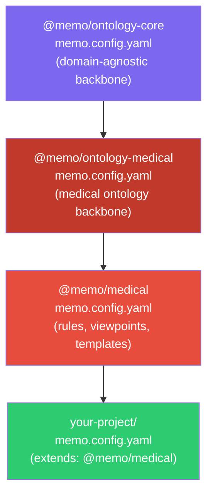

# Configuration System

MEMO uses a YAML-based configuration system with inheritance chains for domain reuse.

## Config Hierarchy



## Inheritance via `extends`

A project config can extend a domain config:

```yaml
# your-project/memo.config.yaml
projectName: ventilator
projectType: device
extends: "@memo/medical"
```

The CLI resolves `@memo/medical` by searching:

1. `node_modules/@memo/medical/memo.config.yaml`
2. Workspace `packages/medical/memo.config.yaml` (monorepo)

## Merge Strategy

When a child extends a parent:

| Field | Strategy | Example |
|---|---|---|
| `projectName` | Child wins | Child's name |
| `projectType` | Child wins | `device` |
| `cosmaLayers` | **Concatenated** | Parent layers + child layers |
| `kinds` | **Merged** (child overrides) | `{ ...parent.kinds, ...child.kinds }` |
| `relationshipTypes` | **Concatenated** | Parent types + child types |
| `closureRules` | **Concatenated** | Parent rules + child rules |
| `viewpoints` | Child wins (or falls back to parent) | Child's viewpoints |
| `workflows` | Child wins (or falls back to parent) | Child's workflows |

This means a project inherits all parent kinds, rules, and layers, but can override specific kinds or replace viewpoints entirely.

## Resolution Algorithm

```typescript
function resolveConfig(config, loader) {
    if (!config.extends) return config;

    const parent = loader(config.extends);
    const resolvedParent = resolveConfig(parent, loader);  // recursive

    return mergeConfigs(resolvedParent, config);
}
```

The resolver walks up the `extends` chain recursively, then merges from root to leaf.

## Config File Discovery

The CLI finds configs by walking up from the current directory:

```
./memo.config.yaml        ← checked first
../memo.config.yaml       ← then parent
../../memo.config.yaml    ← then grandparent
...
```

The first `memo.config.yaml` or `memo.config.yml` found is used.
