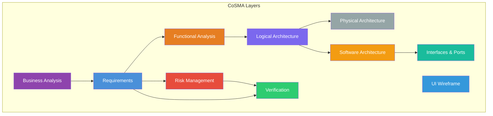

# CoSMA Layers

CoSMA (Concerns-Stakeholder-Model-Architecture) is MEMO's visualization layering system. Every element in the model belongs to exactly one CoSMA layer, enabling structured, color-coded visualization.

## Layer Architecture

The medical domain defines 10 layers:



## Layer Definitions

| ID | Label | Color | Entity Kinds |
|---|---|---|---|
| `business` | Business Analysis | `#8E44AD` | Actor, Stakeholder, Goal, Concern, Responsibility, Capability |
| `requirements` | Requirements | `#4A90D9` | UserNeed, SystemRequirement, SoftwareRequirement, HardwareRequirement, DesignSpecification, Standard, RegulatoryRequirement |
| `risk` | Risk Management | `#E74C3C` | Hazard, HazardousSituation, Harm, Risk, RiskControl, SafetyGoal |
| `functional` | Functional Analysis | `#E67E22` | SystemFunction, ComponentFunction, UserActivity, UIFunction, UseCase, Scenario |
| `logical` | Logical Architecture | `#7B68EE` | System, Subsystem, Component, LogicalComponent, ArchitectureDecision, QualityAttribute |
| `physical` | Physical Architecture | `#95A5A6` | PhysicalComponent, ElectricalComponent, MechanicalComponent, HardwareNode, ComputingDevice, FPGA, Microcontroller |
| `software` | Software Architecture | `#F39C12` | Software, SoftwareComponent, SoftwareModule, Firmware, Docker, OperatingSystem, RosNode |
| `interfaces` | Interfaces & Ports | `#1ABC9C` | Port, DataPort, FlowPort, Interface, SoftwareInterface, RosTopic, RosService, DataType |
| `verification` | Verification | `#2ECC71` | Test |
| `ui` | UI Wireframe | `#3498DB` | UIScreen, UIPanel, UIElement |

## How Layers Work

### 1. Kind → Layer Mapping

Each entity kind in `memo.config.yaml` declares its layer:

```yaml
kinds:
  Hazard:
    label: Hazard
    layer: risk
    sysmlConstruct: part def
```

### 2. Element Layer Assignment

When the builder creates a `MemoElement`, it reads the kind's layer from config:

```typescript
const element: MemoElement = {
    id: 'OverInfusion',
    kind: 'Hazard',
    layer: 'risk',    // from config.kinds.Hazard.layer
    ...
};
```

### 3. Visualization

In the web app:

- **Diagram nodes** are color-coded by layer color
- **ModelExplorer** groups elements by layer in the sidebar
- **CompletenessBar** shows per-layer fill percentages
- **Viewpoints** filter by layer (among other criteria)

### 4. Completeness Tracking

Completeness is computed per layer. An element is "complete" if it has no error-severity violations:

```
risk:          ████████░░  80%  (4/5 elements complete)
requirements:  ██████░░░░  60%  (6/10 elements complete)
overall:       ███████░░░  67%  (10/15 elements complete)
```

## Customizing Layers

Add or modify layers in your `memo.config.yaml`:

```yaml
cosmaLayers:
  - id: cybersecurity
    label: Cybersecurity
    color: "#E91E63"
```

Then assign kinds to the new layer:

```yaml
kinds:
  ThreatModel:
    label: Threat Model
    layer: cybersecurity
    sysmlConstruct: part def
```
