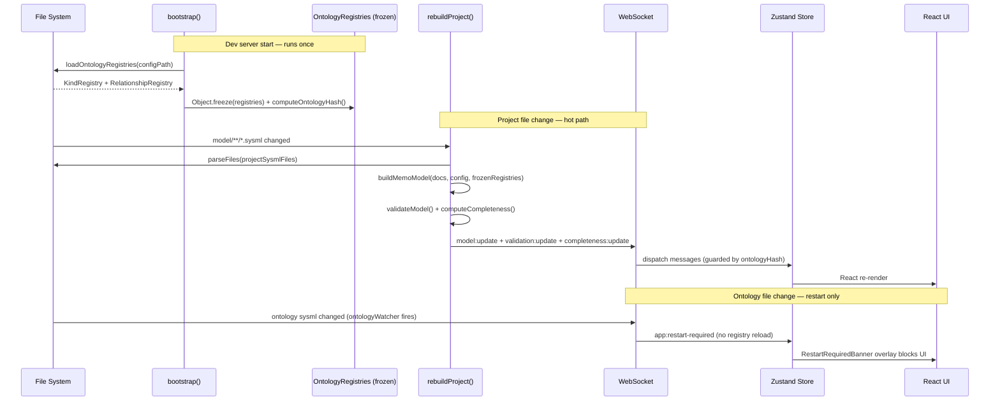
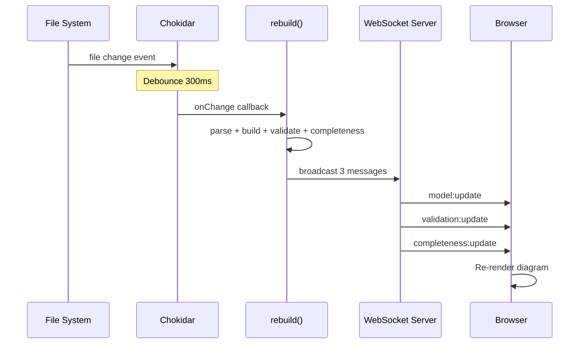

# Data Flow

This page traces how data flows from `.sysml` source files through the system to the browser diagram.

## End-to-End Pipeline

The pipeline has two distinct phases: **bootstrap** (runs once at dev server start) and **hot rebuild** (runs on every project file change).



**Key invariant:** Ontology registries are loaded exactly once at bootstrap and frozen. `rebuildProject()` never calls `loadOntologyRegistries()`. Any ontology change triggers `app:restart-required` — the server does not hot-swap registries.

## Key Data Types

### MemoElement

Represents a single model element (part, requirement, action, port):

```typescript
interface MemoElement {
    id: string;          // Unique identifier (usage name)
    name: string;        // Human-readable name
    kind: string;        // Ontology kind key, e.g. "Hazard"
    construct: string;   // SysML construct: "part", "requirement", etc.
    dimensions: string[]; // architecture, compliance, artifact, viewpoint
    archLayer?: string;  // operational, software, safety, cybersecurity, etc.
    file: string;        // Source file path
    attributes: Record<string, string>;
    doc?: string;        // Doc comment
}
```

### MemoRelationship

A typed edge between two elements:

```typescript
interface MemoRelationship {
    id: string;          // Auto-generated ID
    type: string;        // Relationship type: "mitigates", "traceTo", etc.
    sourceId: string;    // Source element ID
    sourceEnd: string;   // Source end name from connection def
    targetId: string;    // Target element ID
    targetEnd: string;   // Target end name from connection def
    file: string;        // Source file path
}
```

### MemoModel (in-memory)

The full semantic graph with derived indexes:

```typescript
interface MemoModel {
    elements: Map<string, MemoElement>;
    relationships: MemoRelationship[];
    errors: ParseError[];
    // Derived indexes:
    elementsByKind: Map<string, MemoElement[]>;
    elementsByDimension: Map<string, MemoElement[]>;
    elementsByArchLayer: Map<string, MemoElement[]>;
    relationshipsByType: Map<string, MemoRelationship[]>;
    outgoing: Map<string, MemoRelationship[]>;
    incoming: Map<string, MemoRelationship[]>;
}
```

### MemoModelDTO (wire format)

JSON-serializable version sent over WebSocket:

```typescript
interface MemoModelDTO {
    elements: Record<string, MemoElement>;
    relationships: MemoRelationship[];
    errors: ParseError[];
    viewpoints?: ViewpointDTO[];
    methodology?: MethodologyDTO;
    dimensions?: DimensionDTO[];
}
```

## Live Reload Flow

When a `.sysml` file changes on disk:



## Viewpoint Filtering

Viewpoint filtering happens **client-side** in the browser:

1. The server sends the full model + viewpoint definitions in the DTO
2. The user selects a viewpoint in `ViewpointSelector`
3. `DiagramCanvas` builds a filter function from the viewpoint type, visible kinds, and methodology scope
4. `computeLayout()` applies the filter to produce a subgraph
5. ELK.js lays out only the visible elements
6. Relationships are included only if both endpoints are visible

This keeps the server stateless with respect to the selected view — it sends the current model and methodology scope, and the client projects that model into tabs and diagrams.
