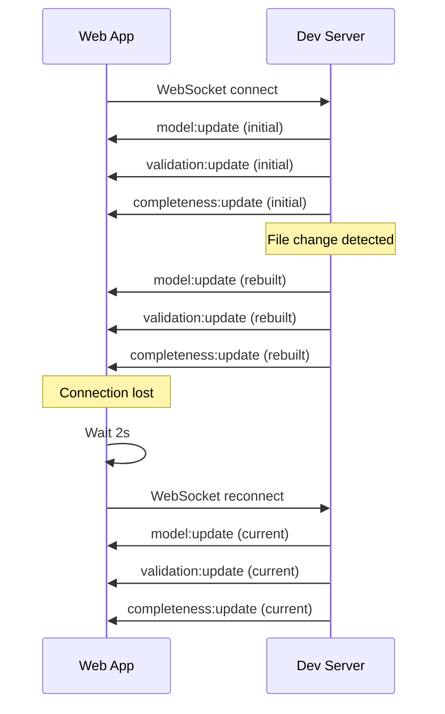

# WebSocket Protocol

The dev server communicates with the web app via a simple JSON WebSocket protocol.

## Connection

The web app connects to the dev server's WebSocket endpoint:

```
ws://localhost:3000
```

On initial connection, the server immediately sends three messages with the current model state.

## Server → Client Messages

All server messages follow this shape:

```typescript
interface ServerMessage {
    type: string;
    payload: unknown;
}
```

### `model:update`

Sent on initial connection and after each rebuild.

```json
{
    "type": "model:update",
    "payload": {
        "elements": {
            "PumpSystem": { "id": "PumpSystem", "name": "Infusion Pump", "kind": "System", ... },
            "OverInfusion": { "id": "OverInfusion", "name": "Over-infusion", "kind": "Hazard", ... }
        },
        "relationships": [
            { "id": "r-0", "type": "mitigates", "sourceId": "FlowSensor", "targetId": "OverInfusion", ... }
        ],
        "errors": [],
        "viewpoints": [
            { "id": "risk-overview", "label": "Risk Overview (ISO 14971)", "visibleKinds": ["Hazard", ...], ... }
        ],
        "dimensions": [
            { "id": "architecture", "label": "Architecture" },
            { "id": "compliance", "label": "Compliance" },
            { "id": "artifact", "label": "Artifacts" },
            { "id": "viewpoint", "label": "Viewpoints" }
        ]
    }
}
```

### `validation:update`

Sent after closure rule evaluation.

```json
{
    "type": "validation:update",
    "payload": {
        "violations": [
            {
                "ruleId": "CR-MED-001",
                "description": "Every Hazard must have at least one mitigates relationship",
                "severity": "error",
                "elementId": "UnmitigatedHazard",
                "elementKind": "Hazard",
                "elementName": "Unmitigated hazard",
                "dimension": "compliance",
                "standard": "ISO 14971"
            }
        ],
        "rulesEvaluated": 15,
        "rulesPassed": 13,
        "timestamp": "2024-01-15T10:30:00.000Z"
    }
}
```

### `completeness:update`

Sent after completeness computation.

```json
{
    "type": "completeness:update",
    "payload": {
        "groups": [
            { "id": "safety", "dimension": "architecture", "label": "Safety", "total": 5, "complete": 3, "percentage": 60 },
            { "id": "iec-62304", "dimension": "compliance", "label": "IEC 62304", "total": 8, "complete": 5, "percentage": 62 }
        ],
        "overall": 58,
        "totalElements": 25,
        "completeElements": 15
    }
}
```

### `app:restart-required`

Sent when the ontology source or selection changes on disk. The server **does not reload registries** — the client must restart the dev server (`Ctrl+C`, then `memo-architect dev`) to apply changes.

```json
{
    "type": "app:restart-required",
    "reason": "ontology-source-changed",
    "changedFile": "/path/to/ontology/architecture/safety/hazard.sysml",
    "instruction": "Stop dev server (Ctrl+C) and run `memo-architect dev` again to apply ontology changes."
}
```

**Reasons:**

| `reason` | Trigger |
|----------|---------|
| `ontology-source-changed` | File watcher detected a change in ontology or methodology SysML/package metadata |
| `ontology-selection-changed` | User saved methodology or ontology selection via the UI |

**Client behaviour:** On receipt, the web app shows a blocking modal overlay (`RestartRequiredBanner`) and stops accepting `model:update`, `validation:update`, and `completeness:update` messages. Clicking "Reload page" triggers `window.location.reload()` which reconnects to the freshly bootstrapped server.

**Ontology hash field:** Every `model:update` and `ontology:packages` message carries an `ontologyHash` field (16-char hex sha256 of kind + relationship names). The web client stores the hash from the first `ontology:packages` received. If a later message carries a different hash (stale server race after restart), the client triggers `app:restart-required` locally.

### `error`

Sent when the server encounters an unrecoverable error.

```json
{
    "type": "error",
    "payload": {
        "message": "Failed to parse model",
        "details": "Unexpected token at line 42"
    }
}
```

## Client → Server Messages

### `request:refresh`

The client can request a full rebuild:

```json
{
    "type": "request:refresh"
}
```

## Reconnection

The WebSocket client automatically reconnects every 2 seconds if the connection drops. On reconnect, the server resends the current model state.

## Message Flow Diagram


