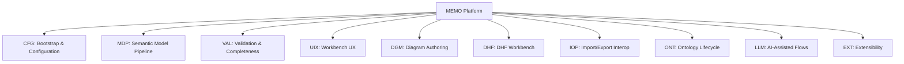

# Functional Decomposition Tree (Principal-Architecture View)

This decomposition is derived from the implementation, then aligned to LikeC4 views.

## Evidence Baseline

- Source files scanned: `180`
- Function-like symbols indexed: `968`
- Primary code roots: `packages/cli`, `packages/core`, `packages/web`, `packages/ontology-core`, `packages/ontology-medical`
- LikeC4 anchor: `docs/likec4/model.c4`

## L0-L2 Tree

## L3-L4 Decomposition by Domain

## CFG: Project Bootstrap & Configuration

| L3 capability | L4 modules | Representative functions |
|---|---|---|
| Project initialization | `packages/cli/src/commands/init.ts` | `initCommand`, `discoverOntologies`, `loadProfile`, `resolveArchetypeTemplate` |
| Package scaffolding | `packages/cli/src/commands/create-package.ts` | `createPackageCommand`, `scaffoldOntology`, `scaffoldProfile`, `scaffoldDevice` |
| Lock and config integrity | `packages/cli/src/commands/lock.ts`, `packages/cli/src/lock.ts`, `packages/core/src/model/config-loader.ts` | `lockCommand`, `createLockFile`, `checkLockFile`, `loadConfig`, `resolveConfig` |

## MDP: Semantic Model Pipeline

| L3 capability | L4 modules | Representative functions |
|---|---|---|
| SysML parsing | `packages/core/src/model/parser-utils.ts`, `packages/core/src/language/*` | `parseFiles`, `createMemoSysMLServices` |
| Semantic model building | `packages/core/src/model/builder.ts`, `packages/core/src/model/semantic.ts` | `buildMemoModel`, `extractFromPackage`, `extractUsage`, `modelToDTO`, `dtoToModel` |
| Registry resolution | `packages/core/src/model/kind-registry.ts`, `relationship-registry.ts`, `package-registry.ts`, `ontology-loader.ts` | `toKindsRecord`, `toRelationshipTypesArray`, `buildFromDocuments`, `loadOntologyRegistries` |

## VAL: Validation & Completeness

| L3 capability | L4 modules | Representative functions |
|---|---|---|
| Closure-rule evaluation | `packages/core/src/validator/rule-engine.ts` | `evaluateClosureRules`, `evaluateRule`, `checkRequireRelationship`, `checkRequireAttribute` |
| Behavioral checks | `packages/core/src/validator/behavior-validator.ts` | `validateBehavior` |
| Completeness aggregation | `packages/core/src/completeness/tracker.ts` | `computeCompleteness` |
| Structural analytics | `packages/core/src/analysis/dsm.ts`, `impact.ts`, `packages/web/src/analysis/consistency.ts` | `computeDSM`, `reorderDSM`, `computeImpact`, `analyzeConsistency` |

## UIX: Workbench UX & Navigation

| L3 capability | L4 modules | Representative functions |
|---|---|---|
| Unified view routing | `packages/web/src/App.tsx`, `packages/web/src/router.ts` | `UnifiedCanvas`, `renderView`, route composition |
| State orchestration | `packages/web/src/store/model-store.ts` | `setActiveView`, `selectElement`, `selectDiagram`, `setModel`, `applyEdit` |
| Explorer/property surfaces | `packages/web/src/components/*` | `ExplorerPanel`, `UnifiedPropertiesPanel`, `ViewpointBrowser`, `WorkbenchToolbar` |

## DGM: Diagram Authoring & Layout

| L3 capability | L4 modules | Representative functions |
|---|---|---|
| Diagram editing | `packages/web/src/views/DiagramEditor.tsx`, `DiagramCanvas.tsx` | `serializeDiagramToSysML`, `DiagramCanvasInner` |
| Auto-layout and decomposition | `packages/web/src/views/layout.ts` | `computeLayout`, `buildDecompositionTree`, `computeIBDLayout`, `computeTreeLayout` |
| Sidecar persistence | `packages/cli/src/server/dev-server.ts` | `saveDiagramLayout`, `loadAllLayouts`, `broadcastDiagramChange` |

## DHF: DHF Workbench & Evidence Generation

| L3 capability | L4 modules | Representative functions |
|---|---|---|
| Document registry and IR | `packages/core/src/dhf/document-registry.ts`, `document-ir.ts` | `getDocumentType`, `getDocumentsByGroup`, `text`, `table`, `metricGroup` |
| Template compilation | `packages/core/src/dhf/template-engine.ts`, `query-engine.ts`, `query-executor.ts` | `compileDocument`, `createQueryContext`, `executeQuery` |
| Export and change evidence | `packages/core/src/dhf/exporters/*`, `snapshot.ts`, `document-compiler.ts` | `renderDocument`, `createSnapshot`, `diffSnapshots`, `generateRedlineDocument` |
| UI workbench | `packages/web/src/views/DhfWorkbench.tsx`, `DhfDashboard.tsx`, `DhfSettingsPanel.tsx` | editor/render controls and metadata update handlers |

## IOP: Import/Export & Interoperability

| L3 capability | L4 modules | Representative functions |
|---|---|---|
| CSV import/export | `packages/core/src/serializer/csv-io.ts`, `packages/cli/src/commands/import.ts` | `parseElementsCsv`, `parseRelationshipsCsv`, `exportElementsCsv`, `importCsvCommand` |
| External importers | `packages/core/src/importer/*`, `packages/cli/src/commands/import-*.ts` | `importEaJson`, `importCameoXml`, `importSysandProject`, `importOwlTurtle` |
| Model/ontology export | `packages/cli/src/commands/export.ts`, `ontology.ts`, `packages/ontology-*/src/export/owl-exporter.ts` | `exportJsonCommand`, `exportDotCommand`, `ontologyExportSysandCommand`, `exportToOwlTurtle` |

## ONT: Ontology Lifecycle Management

| L3 capability | L4 modules | Representative functions |
|---|---|---|
| Ontology discovery and metadata | `packages/core/src/model/ontology-loader.ts` | `getPackageMetadata`, `buildPackageInfo` |
| Selection persistence | `packages/cli/src/server/dev-server.ts` | `ontology:save-selection` handler writing SysML + YAML selection |
| Install/remove flows | `packages/cli/src/commands/install.ts`, `packages/cli/src/server/dev-server.ts` | `installCommand`, `detectInstallMode`, `ontology:install`, `ontology:remove` handlers |

## LLM: AI-Assisted Flows

| L3 capability | L4 modules | Representative functions |
|---|---|---|
| Provider resolution | `packages/core/src/llm/llm-provider.ts` | `resolveLLMConfig`, `createProvider` |
| Model Q&A | `packages/core/src/llm/ask-engine.ts`, `packages/cli/src/commands/ask.ts` | `askModel`, `askCommand` |
| NL -> SysML generation | `packages/core/src/llm/generate-engine.ts`, `packages/cli/src/commands/generate.ts` | `generateSysml`, `generateCommand` |
| DHF drafting and suggestions | `packages/core/src/llm/draft-engine.ts`, `packages/cli/src/server/dev-server.ts` | `draftDocument`, `llm:draft`, `llm:suggest` handlers |

## EXT: Extensibility & Plugin Platform

| L3 capability | L4 modules | Representative functions |
|---|---|---|
| Plugin registry and dispatch | `packages/core/src/plugin/plugin-registry.ts` | `register`, `list`, `runExport`, `runAllValidation` |
| Plugin loading/scaffolding | `packages/core/src/plugin/plugin-loader.ts`, `plugin-scaffold.ts` | `loadPlugins`, `loadPluginConfig`, `scaffoldPlugin` |
| CLI surface | `packages/cli/src/commands/plugin.ts` | `pluginListCommand`, `pluginCreateCommand`, `pluginRunCommand` |

## Runtime Interaction Decomposition

### Boot and Synchronization Sequence

1. `memo dev` starts CLI server and parses model.
2. Server broadcasts initial state over WebSocket.
3. Web app receives and stores:
   - `model:update`
   - `validation:update`
   - `completeness:update`
   - `ontology:packages`
   - `llm:status`
4. UI routes and explorer surfaces render from store state.

### Edit Roundtrip Sequence

1. User edits element/relationship/diagram in UI.
2. Client emits protocol message (`element:update`, `relationship:add`, `diagram:update`, etc.).
3. CLI persists to filesystem (`.sysml`, `.memo/layouts`, `.memo/user-diagrams.json`).
4. Watcher triggers model rebuild and rebroadcast.
5. UI updates from canonical filesystem-backed state.

## Alignment to LikeC4

- Landscape/containers: `docs/likec4/model.c4` (L0/L1)
- Core internals: `@memo/core` component set in LikeC4
- CLI internals: `@memo/cli` component set in LikeC4
- Web internals: `@memo/web` component set in LikeC4
- Runtime flow: protocol and roundtrip sections in LikeC4

## Exhaustive Implementation Appendix

- Full symbol-level inventory: [Function Catalog](function-catalog.md)
- Subsystem counts: [Capability Statistics](capability-statistics.md)
