# MEMO SysML v2 Ontology Review

**Goal:** Assess the ontology for modelling medical devices, where the **end user can extend and pick-and-choose** what they need.

---

## 1. Ontology at a Glance

```mermaid
graph TD
    subgraph "base/"
        DIM["dimensions"]
        SEM["semantics (metadata defs)"]
        METH_BASE["methodology base"]
        RULES_BASE["rules base types"]
        STDLIB["stdlib wrappers"]
    end

    subgraph "core/"
        ENUM["enumerations (60 enum defs)"]
        COMMON["common (IdentifiedElement → TraceableElement hierarchy)"]
        REL["relationships (~70 SemanticLink specializations)"]
    end

    subgraph "architecture/ (14 sub-packages)"
        CTX["context"]
        OPS["operational"]
        SYS["system"]
        FUNC["functions"]
        LOG_S["logical_structure"]
        LOG_I["logical_interfaces"]
        BEH["behavior"]
        SW["software_structure"]
        HW["hardware_structure"]
        PHY_I["physical_interfaces"]
        PHY["physical"]
        RISK["risk"]
        CYBER["cybersecurity"]
        ASSURE["assurance"]
        ANALYSIS["analysis (FMEA/FTA/HAZOP)"]
        CONSTR["constraints"]
        DEC["decisions"]
    end

    subgraph "compliance/"
        ISO14971["iso_14971 RMF"]
        ARTIFACTS_C["controlled artifacts"]
        CHANGE["change management"]
        POST["postmarket"]
    end

    subgraph "rules/ (5 packs)"
        R_CLOSE["closure (~15 native constraints)"]
        R_COV["coverage (~25 metadata-only)"]
        R_CROSS["cross-layer (3)"]
        R_LIFE["lifecycle (3 metadata-only)"]
        R_QUANT["quantitative (2 native)"]
    end

    subgraph "viewpoints/ & views/"
        VP_CORE["viewpoint core"]
        VP_DEF["4 default viewpoints"]
        V_CORE["view core"]
        V_DOC["document views"]
    end

    subgraph "methodology/"
        M_CORE["core (MethodologyLibrary, Archetype, etc.)"]
        M_ARCH["archetypes (7 presets)"]
        M_PROF["profiles + workflow + gates + patterns"]
        M_GPCA["GPCA variant (scope subtraction)"]
    end

    COMMON --> REL
    COMMON --> CTX & OPS & SYS & FUNC & LOG_S & SW & HW & RISK & CYBER & ASSURE
    RULES_BASE --> R_CLOSE & R_COV
    M_CORE --> M_ARCH & M_PROF
```



---

## 2. Structural Architecture

### 2.1 Inheritance Hierarchy

The ontology uses a clean **four-tier specialization chain** rooted in `part def`:

| Level | Type | Purpose |
|-------|------|---------|
| 0 | `IdentifiedElement` | `id`, `name`, `description` |
| 1 | `TraceableElement` | Adds `rationale`, `sourceReference` |
| 2 | Role-typed elements | `RequirementDriver`, `VerifiableElement`, `ArchitectureElement`, `InterfaceElement`, `EvidenceElement` |
| 3 | Domain-specific defs | `SoftwareComponent`, `Hazard`, `Threat`, etc. |

The Level-2 "role" types (`VerifiableElement`, `ArchitectureElement`, etc.) are the **extension points** — they control which side of a `SemanticLink` an element can participate in. This is a solid design pattern.

### 2.2 Relationship Model

All relationships are specializations of `SemanticLink` (which itself specializes `TraceableElement`). Each link carries:
- `linkStatus : LinkStatusKind` — planned/active/verified/obsolete
- Typed end-point parts (e.g., `part sourceRiskElement : TraceableElement`)

There are **~70 distinct link types** covering:
- Requirements traceability (6 link types)
- Risk chains (7 link types — FMEA, FTA, HAZOP, hazard-to-control)
- Cybersecurity (7 link types — STRIDE/FDA threat-asset-vulnerability)
- Architecture allocation (5 link types)
- Verification/evidence (3 link types)
- Operational/system (6 link types)
- Physical architecture (3 link types)
- Change/usability (3 link types)

### 2.3 Enumerations

60 `enum def`s provide the controlled vocabularies. Noteworthy characteristics:

| Category | Count | Examples |
|----------|-------|---------|
| Safety & Risk | 10 | `CriticalityKind`, `SafetyClassKind`, `RiskControlKind`, `HazardTypeKind`, `FailureModeKind` |
| Architecture | 12 | `InterfaceKind`, `FlowKind`, `DirectionKind`, `SchedulingPolicyKind`, `DeploymentKind` |
| Process & Lifecycle | 8 | `LifecycleStateKind`, `RequirementStatusKind`, `WorkflowStageKind`, `ChangeTypeKind` |
| Verification & Assurance | 5 | `VerificationMethodKind`, `ValidationMethodKind`, `ArtifactKind` |
| Cybersecurity | 4 | `ThreatCategoryKind`, `CyberControlKind`, `AssetKind` |
| Behavior & Analysis | 12 | `BehaviorPropertyKind`, `FaultTreeGateKind`, `HAZOPGuideWordKind`, `ActionKind` |
| UI/Presentation | 5 | `ViewOutputKind`, `PresentationKind`, `DocumentViewKind`, `AudienceKind` |

---

## 3. The Pick-and-Choose System

This is the ontology's most architecturally significant feature for end users. It operates at **three levels**:

### 3.1 Level 1: Archetypes (Project Templates)

[memo_archetypes.sysml](file:///home/mando1/sandbox/memo/memo-tools/memo/methodology/memo/memo_archetypes.sysml) defines **7 presets** that select which architecture layers and standards to include:

| Archetype | Layers | Standards | Typical Use |
|-----------|--------|-----------|-------------|
| **Blank** | none | none | Start from scratch |
| **Minimal** | context, requirements, risk | ISO 14971 | Quick risk analysis |
| **Standard** | + functions, logical, SW, assurance | + IEC 62304, 21 CFR 820 | Class II devices |
| **Full** | all 14 layers | all 9 standards | Complex Class III |
| **SaMD** | SW-focused + cybersecurity | + IEC 82304-1, FDA Cyber | Software as Medical Device |
| **Connected** | + HW, logical interfaces | + FDA Cyber | IoT/wearable |
| **Monitoring** | + physical interfaces | + IEC 60601-1 | Patient monitors |
| **Infusion Pump** | all + behavior, arch_risk | all major | Drug delivery |

> [!TIP]
> This is well-designed. Each archetype is a declarative list of `includedLayer` and `includedStandard` values. The engine can filter the ontology catalog at project init time. The `Blank` archetype means full customization is always available.

### 3.2 Level 2: Methodology Scope (Subtraction-Based Tailoring)

[MethodologyScope](file:///home/mando1/sandbox/memo/memo-tools/memo/base/methodology.sysml#L32-L39) supports **additive includes + explicit excludes**:

```
includedArchLayer = "context"
includedArchLayer = "requirements"
...
excludedKind = "CybersecurityAsset"
excludedKind = "SOUPComponent"
```

The GPCA pump example demonstrates this: it starts from the default scope and subtracts the cybersecurity layer for a non-networked prototype. This is **elegant and auditable** — the diff between default and GPCA scope is visible directly in the model.

### 3.3 Level 3: Regulatory Rule Packs

Coverage rules are organized by standard (ISO 14971, IEC 62304, FDA 21 CFR 820, etc.). The `MethodologyScope.includedStandard` field determines which rule packs are active. Users can:
- Drop ISO 14155 coverage if no clinical investigation is planned
- Add FDA Cybersecurity rules for connected devices
- Select IEC 60601-1 only for electrical safety-relevant devices

---

## 4. Extensibility Mechanisms

### 4.1 What Works Well

1. **Specialization is clean.** User models specialize ontology `part def`s. E.g., a user can do `part def MyCustomRequirement specializes Requirement { attribute myField : String; }`.

2. **`metadata def` for annotation.** [semantics.sysml](file:///home/mando1/sandbox/memo/memo-tools/memo/base/semantics.sysml) provides `StandardReference` and `Provenance` metadata defs. Users can annotate any element with `@StandardReference { standard = "IEC 60601-1"; clause = "8.5"; }` without modifying the ontology.

3. **Viewpoints are declared as `userExtensible = true`.** All four default viewpoints carry this flag, signaling that users can add elements/relationships beyond the defaults.

4. **`ExchangeItem` + `DataDefinition`/`ControlDefinition`** let users define domain-specific data types without touching core types.

5. **The GPCA example is a real reference model** — 13 `.sysml` files covering requirements, architecture, behavior, risk, cybersecurity, verification, traceability, views, and methodology binding. This is excellent for onboarding.

### 4.2 Gaps and Concerns

> [!WARNING]
> ### 4.2.1 No Extension Package Protocol
> There is no documented convention for how a user creates a "MEMO extension package." The archetypes select *subsets* of the existing ontology but there's no mechanism for a user to **register new element kinds** that participate in the existing rule/viewpoint system. For example:
> - If a user creates `part def GeneticTestKit specializes HardwareAssembly`, the closure rules won't know about it
> - Coverage rules reference hard-coded type names like `"SoftwareComponent"`, `"Hazard"` — user specializations may silently escape coverage

> [!WARNING]
> ### 4.2.2 `String`-Typed References Instead of Model References
> Many structural links use `attribute someReference : String` where a typed `ref` or `part` would be stronger:
> - `Transition.sourceState`, `Transition.targetState` — should reference `ModeState`
> - `InteractionMessage.senderComponent`, `receiverComponent` — should reference `ArchitectureElement`
> - `FunctionalChainStep.allocatedFunction` — should reference `LogicalFunction`
> - `ComponentExchange.sourcePort`, `targetPort` — should reference port defs
>
> This weakens traceability and makes it impossible for rules to validate structural integrity through the type system.

> [!IMPORTANT]
> ### 4.2.3 Flat Enum Architecture
> All 60 `enum def`s live in a single file (`memo_enumerations.sysml`, 64 lines). Users cannot:
> - Add values to an existing enum (SysML v2 enums are closed)
> - Know which enums belong to which layer/module
>
> If a user needs `HazardTypeKind::radiationExposure`, they must fork the enum or use a `String` override — both break the closed-world assumption of the rules.

> [!NOTE]
> ### 4.2.4 Lifecycle/Ordering Rules Are Metadata-Only
> The lifecycle rules (`LC-001`, `LC-002`, `LC-003`) and most coverage rules have **no executable constraint body** — they're placeholders. This is honest (noted in comments) but means the ontology can't enforce 40% of its stated rules. The end user might think these are being checked.

> [!NOTE]
> ### 4.2.5 `part def` vs `item def` Inconsistency
> The ontology uses `part def` for most elements but switches to `item def` for certain risk entities (`Hazard`, `Harm`, `SequenceOfEvents`, `HazardousSituation`, `RiskControl`) and analysis types (`FailureMode`, etc.). The semantic distinction isn't documented. SysML v2 `item def` implies a transferable, non-compositional element — this *is* correct for hazards/harms (they aren't "parts" of the device) but the rationale should be explicit for users.

> [!NOTE]
> ### 4.2.6 No Import Granularity Below Package Level
> The `medical_device_library.sysml` façade imports 25 packages with wildcard `*`. A user who wants "just risk" still gets all of `core::*`, `architecture::*`, and `viewpoints::*`. While sysand can tree-shake, this makes the *cognitive* surface large.

> [!WARNING]
> ### 4.2.7 No `doc` Comments on Definitions
> None of the ~70 `part def` / `item def` definitions use SysML v2's native `doc` keyword. For example, [memo_common.sysml](file:///home/mando1/sandbox/memo/memo-tools/memo/core/memo_common.sysml) defines:
> ```
> part def IdentifiedElement {
>     attribute id : String;
>     attribute name : String;
>     attribute description : String;
> }
> ```
> Per the SysML v2 spec, every definition should carry a `doc` comment explaining its purpose and usage intent:
> ```
> part def IdentifiedElement {
>     doc /* Root of the MEMO element hierarchy. Every model element
>            carries a unique identifier, a human-readable name, and
>            a free-text description. */
>     attribute id : String;
>     attribute name : String;
>     attribute description : String;
> }
> ```
> This matters for tooling (SysIDE/SysON tooltips, auto-generated documentation) and for end users trying to understand which type to specialize.

> [!WARNING]
> ### 4.2.8 Base Elements Lack a Comment/Annotation Attribute
> `IdentifiedElement` has `description` but no `comment` attribute for ongoing user annotations. In practice, teams use comments differently from descriptions:
> - `description` — the formal, stable definition of what the element *is*
> - `comment` — informal, evolving notes ("needs review", "TBD: check with clinical team", "per meeting 2026-05-15")
>
> Without a `comment` field, users overload `description` or `rationale` for both purposes, degrading data quality.

> [!WARNING]
> ### 4.2.9 No Standard-Linking Attributes on Base Elements
> The only way to tie an element to a regulatory standard is via the optional `metadata def StandardReference` in [semantics.sysml](file:///home/mando1/sandbox/memo/memo-tools/memo/base/semantics.sysml):
> ```
> @StandardReference { standard = "ISO 14971"; clause = "5.4"; }
> ```
> This works but is **invisible unless you know to look for it**. Adding `applicableStandard : String` and `applicableClause : String` directly on `TraceableElement` would:
> - Make regulatory traceability a first-class, discoverable attribute on every element
> - Enable rules and views to filter/query by standard without parsing metadata annotations
> - Align with the ontology's own coverage rules, which already reference standards and clauses as plain attributes
>
> The `metadata def` approach should remain available for *additional* standard references, but the primary link should be structural.

> [!WARNING]
> ### 4.2.10 Inconsistent Relationship Naming — Nouns vs Verbs
> The ~70 relationship types in [memo_relationships.sysml](file:///home/mando1/sandbox/memo/memo-tools/memo/core/memo_relationships.sysml) use **two conflicting naming conventions**:
>
> | Style | Count | Examples |
> |-------|-------|----------|
> | Noun + `Link` suffix | ~18 | `RequirementSatisfactionLink`, `HazardMitigationLink`, `FunctionAllocationLink`, `AssetThreatLink`, `CyberSafetyTraceLink` |
> | Verb phrase | ~50 | `DerivesInto`, `Validates`, `Performs`, `CausesEffect`, `ContributesToHazard`, `MitigatedByControl` |
>
> The noun-based names cluster in the **first 20 lines** (the original batch), while verb names dominate the **later additions** — suggesting the convention drifted over time.
>
> Verb-based names are preferable because:
> - They read naturally in model context: *"this Hazard `MitigatedByControl` that RiskControl"* vs *"there exists a `HazardMitigationLink` between..."*
> - SysML v2 connection/relationship idiom favors active voice
> - The ontology's own rules already use verb-style navigation (`mitigates->size()`, `satisfiedBy->size()`, `traceTo->size()`), creating a mismatch with the noun-based link type names
>
> **Suggested renames for the noun-based batch:**
>
> | Current (Noun) | Proposed (Verb) |
> |----------------|----------------|
> | `RequirementSourceLink` | `DerivedFromSource` |
> | `RequirementSatisfactionLink` | `Satisfies` |
> | `HazardMitigationLink` | `Mitigates` |
> | `FunctionAllocationLink` | `AllocatesFunction` |
> | `InterfaceRealizationLink` | `RealizesInterface` |
> | `VerificationLink` | `Verifies` |
> | `EvidenceProductionLink` | `ProducesEvidence` |
> | `DocumentInclusionLink` | `IncludesInDocument` |
> | `RiskTraceLink` | `TracesToRisk` |
> | `ExecutionOrderLink` | `Precedes` |
> | `MethodologyBindingLink` | `BindsMethodology` |
> | `AssetThreatLink` | `ThreatenedBy` |
> | `ThreatVulnerabilityLink` | `ExploitsVulnerability` |
> | `ThreatScenarioLink` | `RealizesScenario` (already exists — needs disambiguation) |
> | `VulnerabilityMitigationLink` | `MitigatesVulnerability` |
> | `CyberRequirementDerivationLink` | `DerivesCyberRequirement` |
> | `CyberSafetyTraceLink` | `TracesToSafety` |
> | `TrustBoundaryCrossingLink` | `CrossesTrustBoundary` |

---

## 5. Regulatory Coverage Assessment

| Standard | Ontology Coverage | Rules | Verdict |
|----------|-------------------|-------|---------|
| **ISO 14971** (Risk Management) | ✅ Full: Hazard → Seq-of-Events → HazSit → Harm → Risk → Control → Residual, RiskMatrix, Overall eval | 4 closure + 3 coverage | **Excellent** |
| **IEC 62304** (Software Lifecycle) | ✅ Full: SoftwareSystem, SoftwareComponent, SOUPComponent, SBOMEntry, safety class | 3 closure + 2 coverage | **Good** |
| **ISO 13485** (QMS) | ⚠️ Partial: StakeholderNeed coverage only. No design control, CAPA, supplier, or process modeling | 1 coverage | **Minimal** — just a touch point |
| **21 CFR 820** (FDA QSR) | ⚠️ Partial: Design input/verification coverage. Missing design review, transfer, validation specifics | 2 coverage | **Basic** |
| **IEC 62366** (Usability) | ⚠️ Partial: Actor coverage, UseError type. No task analysis, summative/formative test structure | 1 coverage | **Stub** |
| **IEC 60601-1** (Electrical Safety) | ⚠️ Minimal: Harm coverage check only. No ME equipment, protection class, applied part modeling | 1 coverage | **Stub** |
| **IEC 82304-1** (Health Software) | ⚠️ Minimal: SoftwareSystem coverage check only | 1 coverage | **Stub** |
| **FDA Cybersecurity** | ✅ Full: Assets, threats, vulnerabilities, scenarios, trust boundaries, cyber risks, mitigations, security requirements, security claims | 10 coverage + 2 closure | **Excellent** |
| **ISO/IEC/IEEE 42010** (Architecture Description) | ✅ Full: Viewpoint, View, ViewSelectionQuery, DocumentBackedView | Structural | **Good** (embedded in viewpoints/views) |

---

## 6. The GPCA Reference Model

The [examples/gpca-pump/](file:///home/mando1/sandbox/memo/memo-tools/memo/examples/gpca-pump) directory contains a complete, non-trivial model with 13 files (~57 KB total). It demonstrates:

- **Methodology binding:** `memo.config.yaml` pins `@memo/methodology-gpca@^1.0`
- **Scope subtraction:** Cybersecurity and SOUP explicitly excluded for non-networked prototype
- **Full trace chain:** Needs → Requirements → Architecture → Interfaces → Risk → Verification → Evidence → Document Views
- **Formal behavior:** State machines with assume/guarantee contracts and timing constraints
- **FMEA integration** via the analysis layer
- **View generation** with query-driven inclusion rules

> [!TIP]
> This is one of the ontology's greatest strengths. The GPCA example proves the pick-and-choose system actually works end-to-end. A new user can clone it and modify.

---

## 7. Assessment Summary

### Strengths

| # | Strength | Why It Matters for Pick-and-Choose |
|---|----------|-----------------------------------|
| 1 | **Archetype system** with 7 presets | One-click project scaffolding for different device classes |
| 2 | **Subtraction-based scoping** | Auditable methodology tailoring via `excludedKind` |
| 3 | **Layer-granular architecture** (14 layers) | Users include only the layers relevant to their device |
| 4 | **Constraint rules as native SysML v2** | No engine plug-ins needed; portable across SysIDE/SysON/sysand |
| 5 | **Standard-tagged coverage rules** | Rule packs activate per-standard, so removing a standard disables its rules |
| 6 | **Complete reference model** (GPCA) | Shows real usage of the entire pick-and-choose workflow |
| 7 | **Metadata defs for extension** | Non-invasive annotation (StandardReference, Provenance) |
| 8 | **Deep ISO 14971 + cybersecurity** | The two most complex regulatory domains are thoroughly modeled |

### Weaknesses

| # | Weakness | Impact on End User Extensibility | Severity |
|---|----------|----------------------------------|----------|
| 1 | No extension package protocol | User-created specializations invisible to rules/viewpoints | 🔴 High |
| 2 | No `doc` comments on definitions | Users can't discover element purpose from tooling or generated docs | 🔴 High |
| 3 | No standard-linking on base elements | Regulatory traceability requires metadata annotation instead of plain attributes | 🟡 Medium |
| 4 | No comment/annotation attribute | Users overload `description` for informal notes | 🟡 Medium |
| 5 | String-typed structural refs | Can't type-check transitions, allocations, port bindings | 🟡 Medium |
| 6 | Closed enumerations | Users must fork enums or use strings to add domain values | 🟡 Medium |
| 7 | Non-executable lifecycle/coverage rules | ~40% of rules are metadata-only; false sense of coverage | 🟡 Medium |
| 8 | Inconsistent relationship naming | ~18 noun+Link names vs ~50 verb names; convention drift | 🟡 Medium |
| 9 | All-or-nothing import façade | Cognitive overload; no "import just risk" shortcut | 🟢 Low |
| 10 | Stub-level coverage of 60601, 82304, 62366, 13485 | Users of those standards get minimal guidance | 🟡 Medium |
| 11 | Undocumented `part def` vs `item def` choice | Confusing for users extending the ontology | 🟢 Low |

---

## 8. Recommendations

### For Immediate Extensibility Improvement

1. **Define an Extension Package protocol** — document how user packages can register new element kinds so that viewpoint `allowedElementKinds` and rule `appliesTo` can discover them. Consider a `metadata def MemoExtension` that user defs annotate:
   ```
   @MemoExtension { extendsKind = "HardwareAssembly"; layer = "hardware_structure"; }
   part def GeneticTestKit specializes HardwareAssembly { ... }
   ```

2. **Add `doc` comments to all definitions** — every `part def`, `item def`, `enum def`, and `constraint def` in the ontology should carry a SysML v2 `doc` block explaining its purpose, when to use it, and which standard/clause it relates to. This is the SysML v2 standard mechanism for self-documenting models and is essential for tooling integration.

3. **Add `comment` attribute to `IdentifiedElement`** — a free-text annotation field distinct from `description`, allowing users to attach informal notes, review status, or meeting references without polluting the element's formal definition:
   ```
   part def IdentifiedElement {
       doc /* Root of the MEMO element hierarchy. */
       attribute id : String;
       attribute name : String;
       attribute description : String;
       attribute comment : String;
   }
   ```

4. **Add standard-linking attributes to `TraceableElement`** — promote `applicableStandard` and `applicableClause` from the optional `metadata def StandardReference` to first-class attributes:
   ```
   part def TraceableElement specializes IdentifiedElement {
       doc /* Adds traceability and regulatory provenance to any element. */
       attribute rationale : String;
       attribute sourceReference : String;
       attribute applicableStandard : String;
       attribute applicableClause : String;
   }
   ```
   This makes every element in the model queryable by standard/clause without requiring metadata annotation knowledge. Keep the `metadata def StandardReference` for *secondary* standard references.

5. **Standardize relationship names as verbs** — rename the ~18 noun+`Link` relationships to verb phrases (see table in §4.2.10). This aligns the full relationship set with the verb-based convention already used by the majority of links and by the rule navigation expressions (`mitigates->`, `satisfiedBy->`, etc.).

6. **Introduce `enum def` extension guidance** — recommend that users create parallel enum defs (e.g., `MyHazardTypeKind`) and use `attribute hazardTypeExtended : MyHazardTypeKind` alongside the base `hazardType`. Document this pattern in a "MEMO Extension Guide."

7. **Add per-layer import façades** — create lightweight import files like `memo::risk_layer::*` that import only `core::common`, `core::enumerations`, `architecture::risk`, and the risk-relevant relationships. This lets users start small.

### For Ontology Maturity

8. **Strengthen typed references** — replace the highest-impact `String` attributes with proper refs (`Transition.sourceState → ref ModeState`, `InteractionMessage.senderComponent → ref ArchitectureElement`). This enables automated trace analysis.

9. **Graduate lifecycle/coverage rules** — implement the metadata-only rules as model-level `assert` constraints in a dedicated "model-completeness" package, or clearly document them as "advisory catalog entries only."

10. **Deepen the stub standards** — IEC 62366 (usability engineering) and IEC 60601-1 (electrical safety) need at least the same structural depth as ISO 14971. For 62366: add `TaskAnalysis`, `UsabilityTestPlan`, `FormativeStudy`, `SummativeStudy`. For 60601: add `AppliedPart`, `MeansOfProtection`, `ProtectiveEarth`.

---

## 9. Verdict

> [!IMPORTANT]
> The MEMO ontology is a **well-architected, regulation-aware** SysML v2 domain library. Its archetype + methodology-scope + standard-tagged-rules system is the **strongest "pick-and-choose" mechanism** I've seen in a SysML v2 ontology. The main gap for end-user extensibility is the **lack of a formal extension registration protocol** — user specializations currently "fall off the radar" of the rule and viewpoint systems. Addressing recommendation #1 above would elevate this from a strong internal ontology to a genuinely pluggable ecosystem.
