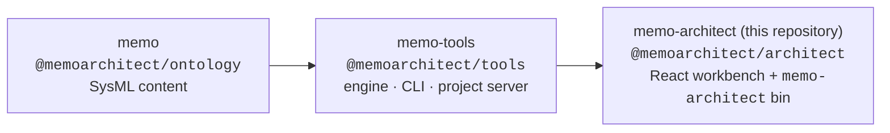
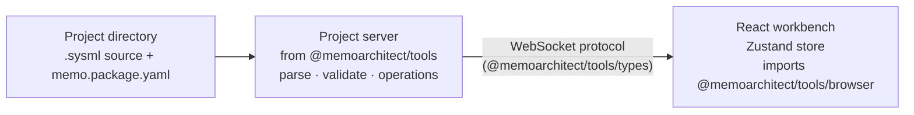

# Codebase Overview

MEMO Architect is the **presentation layer** of the MEMO stack: a React
workbench plus a thin composition CLI. It renders and navigates the model; all
model behavior — parsing, validation, operations, the project server — lives
in `@memoarchitect/tools` so the workbench can never become a second source of
truth.

## Where Architect sits

Dependency direction is strict — `memo ← memo-tools ← memo-architect` — and
lower layers never import from higher ones. `@memoarchitect/tools` and
`@memoarchitect/architect` release in lockstep at the same version;
Architect pins Tools exactly.

## Repository layout

| Path | Purpose |
|---|---|
| `packages/web/src/views/` | Diagram canvas, layout engine, and model views |
| `packages/web/src/components/` | Reusable UI components |
| `packages/web/src/store/` | Zustand state and the WebSocket client |
| `packages/web/src/dhf/`, `analysis/`, `diagram/` | DHF review, analysis, and diagram feature areas |
| `src/bin/memo-architect.ts` | The `memo-architect` bin entry |
| `src/commands/` | `dev` and `build` composition commands |
| `dist/` | Prebuilt web assets bundled into the published package |
| `lib/` | Compiled CLI output |

## How the runtime fits together

`memo-architect dev` does not implement a server. It calls
`startProjectServer` from `@memoarchitect/tools` (the same operations the
`memo` CLI uses) and points it at the web client:

- The server parses and validates the project and pushes model state over a
  WebSocket protocol whose event schemas live in `@memoarchitect/tools/types`.
- The frontend derives diagrams and views with the pure functions in
  `@memoarchitect/tools/browser`.
- Edits flow back as operations; the `.sysml` files remain the source of
  truth.

## The import boundary

The web app imports **only** `@memoarchitect/tools/browser` and
`@memoarchitect/tools/types` — never the root export, which contains Langium
and `node:*` code that must not reach the Vite bundle. Keep it that way: if a
function you need is Node-only, the feature belongs on the server side in
memo-tools, exposed through the protocol.

## Packaging

The published `@memoarchitect/architect` package contains the compiled CLI
(`lib/`) and the prebuilt web app (`dist/`) — the UI is served as static
assets, so installing the package requires no frontend toolchain.
`@memoarchitect/tools` owns the `memo` bin; this package owns `memo-architect`.
Neither re-exposes the other's bin, so both can be installed globally side by
side.

## Key technologies

| Concern | Choice |
|---|---|
| Language | TypeScript, ESM, Node.js ≥ 22 |
| UI | React + Vite |
| State | Zustand, synchronized over WebSocket |
| Parsing (in Tools) | Langium with a SysML v2 grammar |
| Testing | Vitest (unit and E2E) |
| Styling | Vanilla CSS |

## Local development

1. `pnpm install` at the root (use the `memo-meta` workspace for coordinated
   changes across repositories).
2. `pnpm run build` to compile the client and CLI.
3. `pnpm run example:dev` to open the workbench on the GPCA example, or run
   `memo-architect dev` in any MEMO project.
4. `pnpm run test` for the Vitest suite.

Architecture decisions and planning records live in the private `memo-meta`
workspace. For contribution guidelines, see
[Contributing](development/contributing.md).
