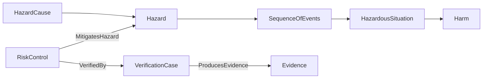

# Medical Modeling Profile

`@memo/medical-modeling-profile` is the standard MEMO profile for medical-device
projects. It combines the reusable `@memo/ontology` vocabulary with medical
modeling rules, viewpoints, archetypes, and project templates.

## Package responsibilities

| Package | Responsibility |
|---|---|
| `@memo/ontology` | Element definitions, relationship definitions, shared semantics, native constraints, and reusable viewpoints |
| `@memo/medical-modeling-profile` | Medical-device project defaults, archetypes, templates, and profile selection |
| `@memo/methodology-default` | General modeling workflow and review gates |
| `@memo/methodology-gpca` | Methodology content used by the GPCA reference project |

Projects normally select the medical profile:

```yaml
extends: "@memo/medical-modeling-profile"
```

Model files import the public library surface:

```sysml
private import memo_medical_device_library::*;
```

## Modeling coverage

The profile organizes a medical-device model around connected engineering
concerns.

| Concern | Representative elements | Principal review question |
|---|---|---|
| Context and use | `IntendedUse`, `Actor`, `UseContext`, `UseError` | Who uses the device, where, and under which conditions? |
| Operations | `OperationalActivity`, `OperationalCapability`, `OperationalScenario` | What work and clinical outcome must be supported? |
| Requirements | `StakeholderNeed`, `SystemRequirement`, `SoftwareRequirement`, `HardwareRequirement` | What measurable obligations apply? |
| Functions and behavior | `LogicalFunction`, `BehaviorMachine`, `ModeState`, `ActivityAction` | What transformations, states, and interactions are required? |
| Architecture | `LogicalComponent`, `SoftwareItem`, `FirmwareItem`, `HardwareAssembly`, `ProcessingNode`, `Interface` | Which design elements own and realize the required behavior? |
| Safety risk | `Hazard`, `SequenceOfEvents`, `HazardousSituation`, `Harm`, `RiskControl` | How can harm occur and where is risk controlled? |
| Cybersecurity | `CybersecurityAsset`, `Threat`, `Vulnerability`, `ThreatScenario`, `CyberMitigation`, `SecurityRequirement` | How can the connected device be compromised and protected? |
| Assurance | `VerificationCase`, `ValidationCase`, `TestArtifact`, `Evidence` | What activity and evidence support each claim? |

## Standards-oriented use

MEMO supplies modeling structures that support standards-oriented engineering
work. Project teams remain responsible for applicability decisions, acceptance
criteria, risk acceptability, approvals, and regulatory interpretation.

### ISO 14971 risk argument

A safety-risk argument connects causes, hazards, event sequences, hazardous
situations, harms, controls, residual-risk records, verification, and evidence.



### IEC 62304 software argument

Software requirements connect to software structure, deployment, SOUP
dependencies, verification cases, anomalies, and lifecycle evidence. The model
keeps system-level intent distinct from software-item responsibility.

### IEC 62366 usability argument

Actors, use contexts, operational activities, user-interface responsibilities,
use errors, risk controls, validation cases, and evidence form the usability
engineering trace.

### IEC 60601 safety argument

System requirements, essential performance claims, hardware and software
responsibilities, interfaces, risk controls, and verification evidence provide
the model structure for applicable safety reasoning.

### ISO 13485 design-control records

Needs, requirements, specifications, design elements, verification and
validation cases, evidence, decisions, and controlled document views support a
traceable design-and-development record.

## Relationship semantics

The profile uses typed relationships rather than labels embedded in prose.

| Relationship | Source role | Target role |
|---|---|---|
| `DerivesFrom` | Need, risk, or other source driver | Requirement |
| `SatisfiedBy` | Required element | Satisfying architecture element |
| `AllocatedTo` | Function | Responsible architecture element |
| `MitigatesHazard` | Risk control | Hazard |
| `VerifiedBy` | Verification target | Verification case |
| `ProducesEvidence` | Verification or validation case | Evidence |
| `DeploysOnto` | Software component | Host assembly |
| `DependsOnSoup` | Software component | SOUP item |

Use `memo ontology show` to inspect the complete relationship registry resolved
for a project.

## Project validation

```bash
memo ontology show
memo validate .
memo rules coverage .
```

Validation identifies unresolved source, unsupported kinds, relationship gaps,
and applicable consistency findings. A finding is an engineering review input;
it does not replace project judgment or approval.

## Interoperability boundary

MEMO models the device engineering concepts and the references needed for
traceability. Externally governed clinical terminologies, regulatory databases,
quality systems, test repositories, and product-data systems retain their own
authority. MEMO elements record identifiers, bindings, provenance, and evidence
locations without duplicating those external authorities.

The ontology uses the SysML v2 textual constructs supported by the MEMO parser
and is checked with external SysML tooling through the configured toolchain.
