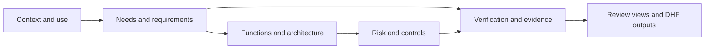

# Understand, review, and improve a medical-device model

MEMO Architect is the visual workbench for models built with the Medical
Engineering Modelling Ontology. It helps engineers explore the device by layer,
follow traceability, inspect gaps, and prepare review artifacts while SysML v2
source remains the system of record.

## Start with what you need to accomplish

| Your goal | Start here |
|---|---|
| Decide which MEMO product you need | [Choose Your MEMO Layer](users/choose-layer.md) |
| Open the included pump model | [First Workbench Session](users/first-session.md) |
| Understand why the model has layers | [Layers and Their Questions](users/layers.md) |
| Decide whether something is a requirement, function, component, or risk | [Choosing Elements](users/elements.md) |
| Build traceability correctly | [Connecting Elements](users/relationships.md) |
| Learn from a complete example | [Worked GPCA Example](users/gpca-example.md) |
| Bring in spreadsheet records | [Import Existing Data](users/importing-data.md) |
| Find and resolve model gaps | [Validation and Closure](users/validation.md) |

## The review path



The workbench gives you different views of this one connected model. A diagram,
matrix, table, or document is not a separate source of truth.

## Five-minute launch

```bash
git clone --recurse-submodules https://github.com/memoarchitect/memo-architect.git
cd memo-architect
corepack enable
pnpm install
pnpm run build
pnpm run example:dev
```

Open `http://localhost:3000`, then follow
[First Workbench Session](users/first-session.md).

!!! note "Project status"
    MEMO is in active development. APIs, views, and model semantics may change
    before the first stable release.
