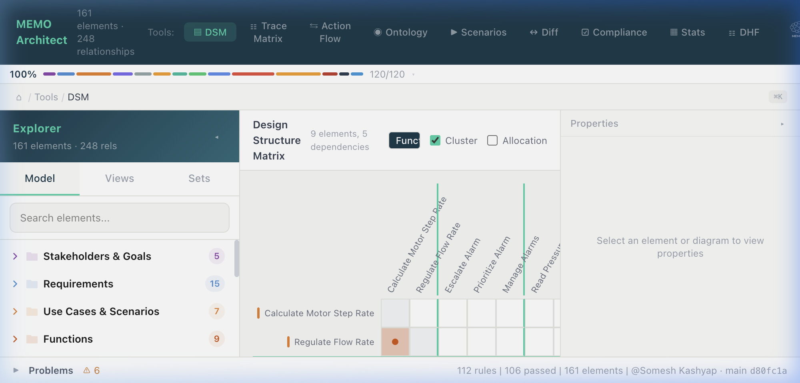
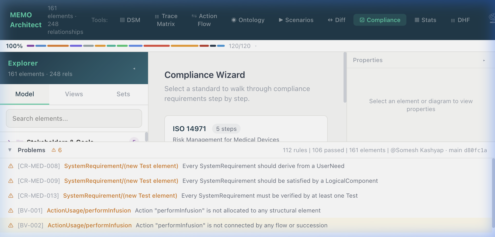

# Analysis Tools

MEMO includes a suite of advanced analysis tools for design verification, dependency management, and risk analysis. These tools are accessible from the top toolbar in the Workbench.

## Jupyter notebooks

**Analysis → Jupyter Notebooks** opens the project's live JupyterLab workspace
at `http://127.0.0.1:8888`. New projects created with `memo init` contain an
`analysis/Samples` folder with seven portable Syside notebooks:

- model overview and semantic composition;
- architecture hotspots and ownership depth;
- model-quality diagnostics;
- change-impact exploration;
- bar and diagnostic donut charts;
- an SVG ownership network graph;
- an HTML inventory table with CSV export.

The samples use standard SysML v2 types and automatically discover either the
nearest `model/` or `src/` directory. Start the local service with:

```bash
source analysis/.venv/bin/activate
cd analysis
jupyter lab --port 8888
```

Syside must be installed and licensed in that environment.

## 1. Design Structure Matrix (DSM)

The DSM shows dependencies between elements as a matrix whose axes are the
model's own containment hierarchy: every row and column is a subsystem that
expands into its parts and collapses back into one line carrying their sum.


*Design Structure Matrix showing functional dependency clusters.*

### How it works

- **Nested axes.** Rows and columns are trees, not flat lists. `+`/`−` expands
  and collapses a subsystem; **Expand all**, **Collapse all** and **L1/L2/L3**
  move both axes at once. With **Linked axes** on, expanding a subsystem on one
  axis expands the same one on the other.
- **Numbered columns.** Columns are identified by number, the way Lattix does
  it — hover a column, or turn on **Column names**, to read its name.
- **Roll-up.** A cell between two collapsed lines carries the count of every
  dependency crossing between their subtrees. The identity diagonal shows the
  subsystem's share of the model's elements.
- **Subsystem boundaries.** A rule is drawn where a subsystem starts, heavier
  for shallower nesting, so block structure is visible without lines running
  the height of the page.

### One semantic type per axis

An axis holds **one** thing, and the picker enforces it. A row list that
interleaved a hazard, a requirement, a function and a test case would be a list
of unrelated objects, and the marks between such rows and columns could not be
read as a structure at all — so the choice is one architecture layer, or one
element type inside it, never a hand-assembled mixture.

A *layer* is the ontology's own unit of semantic kinship, which is why it is
the unit here: `System`, `Subsystem` and `LogicalComponent` are three kinds but
one logical architecture, and they belong on an axis together. Picking the
`Logical` layer gives you that whole tree; picking `LogicalComponent` inside it
narrows to the leaves.

Both matrices **open on a pair derived from the model**, not from a fixed list:

- The DSM opens on the layer whose elements depend on each other the most,
  against itself — the reading a structure matrix exists for.
- Traceability opens on the two layers the model links across the most —
  requirements against verification in one project, functions against
  components in another.

### What you choose

| Control | What it decides |
| --- | --- |
| **Rows** / **Columns** | What that axis holds: **one** architecture layer, or one element type within it. The two axes need not match — functions down the side and logical blocks across the top is a normal configuration. |
| **of** (next to each axis) | Which *individual elements* that axis lists, within its scope. Use the axis scope to say "all the functions" and this to say "these four". |
| **Dependency** | Which relationships put a mark in a cell: flow, trace, allocation, and so on. Empty means every relationship. |
| **Nesting** | Which relationships mean parent → child containment, so the tree is the one the model declares. Defaults to the composition relations the model actually uses. |
| **Order** | *Name*, *Element type*, *Partition* (sequence siblings so dependencies sit above the diagonal, leaving only real cycles as feedback), or *Cluster* (keep mutually dependent siblings adjacent). Ordering applies inside each parent, so the hierarchy is never rearranged out from under you. |
| **Group by package** | Wrap top-level elements in their SysML package, making packages subsystems. |
| **Both directions** | Count every dependency both ways, making the matrix symmetric. |

### Filtering a long list

Every picker is a typeahead, and search is **incremental**: the query is split
into words that *all* have to match, so each word you add narrows the list
further and never widens it. Typing `channel pressure` finds
`PressureIntegrityChannel` in either word order.

- Elements match on **name, kind and either id** — `NDS-LC-008` and
  `pressure` reach the same element.
- Elements are **grouped under their kind**, and the element list only offers
  what the axis scope already allows, so the two controls compose.
- **Select all (n)** takes everything; with a query it becomes **Select
  matches (n)** and takes every match, not only the rows on screen. **None**
  clears the selection, and clicking a row toggles that one element.
- Very long lists paint a capped number of rows and say how many more match —
  keep typing, or take them all in one click.

Picking an element keeps its ancestors on the axis as structural lines, so the
element you asked for is always reachable in the tree rather than orphaned.

### Reading the indicators

- **Feedback** — marks below the diagonal, the candidates for rework loops.
- **Couplings** — pairs that depend on each other in both directions.
- **Isolated** — lines with no dependency either way.
- **Max degree** — the most dependencies touching one line.

---

## 1b. Traceability

Traceability is a separate feature from the DSM, on the same grid: the DSM is
for *reading* the dependency structure, traceability is for *establishing* it.

### Usage

1. Open **Tools → Traceability Matrix**.
2. Pick a **preset** (`Requirement → Function`, `IEC 62304: Requirement →
   Test`, …) as a starting point, then adjust **Rows**, **Columns**, the
   per-axis element filter and **Trace via** freely — presets fill the pickers,
   they are not modes, and applying one clears any hand-picked elements from
   the previous configuration. A preset names several candidate types per axis
   and the axis takes the first one this model actually has, so it can never
   assemble the mixed axis the pickers refuse to.
3. Coverage is reported in the header: how many rows carry at least one trace.

### Adding and removing links

Turn on **Edit links**:

- Clicking an **empty** cell offers the relationship types the ontology says
  are legal between those two elements, with the types you are currently
  tracing via ranked first. Choosing one writes a typed connection into the
  project SysML.
- Clicking a **linked** cell lists what joins the two, each with **Remove**.
- Only leaf-to-leaf cells can be edited. A mark between collapsed subsystems
  sums several links and has no single pair to author — expand both sides
  first.

Editing needs a running dev server, since every change is written to source.
An anonymous connection (one with no declared name in the SysML) can be read
but not removed by id; name it in the source first.

---

## 2. Consistency Analysis

The Consistency Panel provides real-time feedback on logical gaps in your model that simple schema validation cannot catch.


*Consistency Panel showing unallocated functions and missing interface definitions.*

### Key Checks
- **Functional Allocation:** Identification of `Function` elements that are not yet allocated to a `Component`.
- **Interface Needs:** Detection of `DataFlow` relationships that cross `Component` boundaries without a defined `Interface`.
- **Requirement Orphans:** Identification of requirements that do not have a parent (Need) or a child (Design Output).

### Usage
- Open **Tools → Compliance Wizard**.
- The **Problems** panel at the bottom will display a list of consistency violations.
- Click any violation to navigate to the offending element in the **Model Explorer**.

---

## 3. Risk Analysis Views

MEMO provides specialized views for Failure Modes and Effects Analysis (FEMA) and Fault Tree Analysis (FTA).

### FMEA Mode
The FMEA view presents a tabular interface for failure analysis:
- **Failure Mode Identification:** Links to `FailureMode` kinds in the ontology.
- **Effects & Severity:** Automatically pulls severity and probability from linked `Hazard` and `Harm` elements.
- **Risk Control Verification:** Shows the status of verification evidence for each risk control.

### Fault Tree (FTA) View
The FTA view uses a specialized layout for logic gates:
- **Top Events:** Usually linked to a `HazardousSituation`.
- **Intermediate & Basic Events:** Linked via `FaultTreeGate` (AND/OR) relationships.
- **Auto-Layout:** ELK.js provides a hierarchical tree layout optimized for temporal and logical flow.
