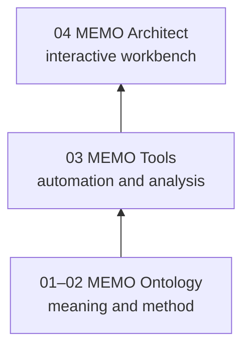

# Choose Your MEMO Layer

MEMO is available as three adoptable products. Choose the highest layer that
matches your workflow; each higher layer includes or consumes the lower ones.

| You need… | Use… | What you get |
|---|---|---|
| A portable SysML v2 vocabulary and methodology | **MEMO Ontology** | Elements, relationships, rules, viewpoints, templates |
| Validation, import/export, packaging, and automation | **MEMO Tools** | The `memo` CLI and reusable model engine |
| Interactive exploration and review | **MEMO Architect** | Web workbench plus the Tools and Ontology capabilities |

## Common choices

- A team already using a conformant SysML v2 editor can adopt only the ontology.
- A CI pipeline or document-generation workflow can use Tools without the UI.
- A cross-functional design review benefits from Architect's diagrams, tables,
  gap views, and document workbench.

All three products share a `MAJOR.MINOR` compatibility line. Keep `0.4.x`
products together, while allowing patch versions to advance independently.

## Continue

If you chose Architect, [install it](installation.md) and open the
[included GPCA example](first-session.md). If you chose a lower layer, use the
documentation site in the corresponding repository.
