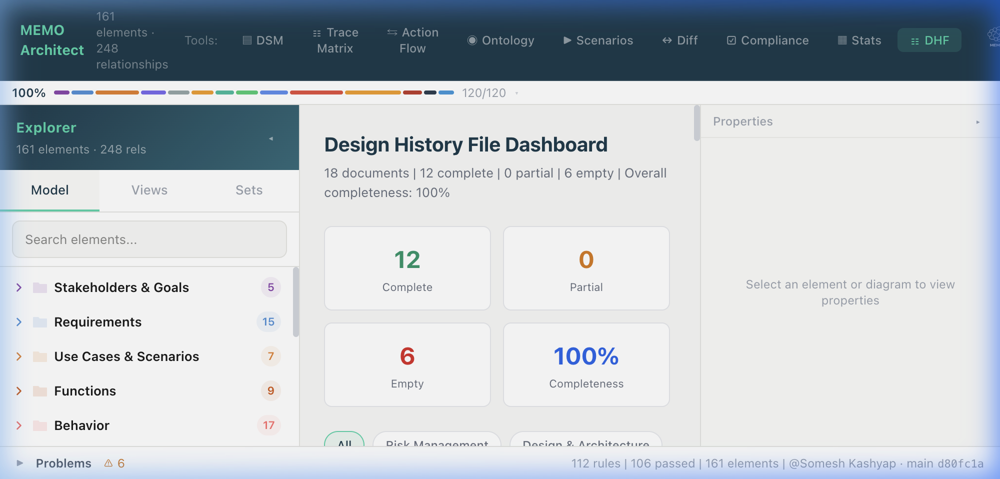

# Design History File (DHF) Workbench

The MEMO DHF Workbench provides a centralized, model-driven environment for generating and managing regulated documentation for medical device development.

> **Terminology note:** "DHF" comes from the FDA's legacy Quality System Regulation (21 CFR 820.30(j)). FDA's QMSR (Quality Management System Regulation, effective February 2026) replaces most of Part 820 by incorporating ISO 13485:2016 by reference, and ISO 13485 §7.3.10 calls the equivalent record the **"design and development file"** rather than "DHF." MEMO keeps "DHF" as the primary term throughout the UI and codebase because it remains the term practitioners and eQMS tooling use day to day — but be aware the current regulation text itself says "design and development file."


*The DHF Dashboard showing completeness metrics across 18 document types.*

## Core Concepts

In MEMO, a document is not a static file but a specialized **View** into the semantic model. As your SysML model evolves, your documents update automatically.

### 1. The 18 DHF Document Types
MEMO includes built-in templates for the 18 essential documents required by ISO 13485, ISO 14971, and IEC 62304.

| Group | Key Documents | Standards |
|---|---|---|
| **Risk** | RMP, Hazard Analysis (HAR), FMEA, FTA | ISO 14971 |
| **Design** | System Arch (SAD), Software Design (SDS), SOUP List | IEC 62304, ISO 13485 |
| **Traceability** | Requirements Traceability Matrix (RTM) | ISO 13485 |
| **Compliance** | Software Dev Plan (SDP), Usability (UER), Cybersecurity | IEC 62366, IEC 81001-5-1 |

### 2. Snapshots & Change Tracking
Regulatory standards require you to maintain a history of changes. 
- **Snapshot:** Captures the current state of a document as a baseline.
- **Diff:** Compares your current model against a previous snapshot to show additions, deletions, and modifications.
- **Redlining:** Automatically generates a "tracked changes" version of a document (HTML or DOCX).

## Workflow

### Reviewing Status
Open the **DHF Dashboard** from the top toolbar to see the status of your entire file.
- **Complete:** All required sections have been populated with model data.
- **Partial:** Some required sections are empty or have validation errors.
- **Empty:** No model data has been allocated to this document type yet.

### Generating Documents
You can generate documents individually or as a "Review Packet."

**Using the UI:**
1. Click a document card in the DHF Dashboard.
2. Review the live preview.
3. Click **Export** and choose your format (HTML, DOCX, or PDF).

**Using the CLI:**
```bash
# Export the Risk Management Plan to Word
memo export dhf --target rmp --format docx

# Generate a full review packet for a design review
memo dhf review-packet --output ./v1-baseline
```

## Configuration

Control which documents are enabled and what standards they target in your `memo.dhf.yaml` file:

```yaml
# memo.dhf.yaml
organization: "Acme Medical"
phase: "Design & Development"
enabled_documents:
  - rmp
  - har
  - fmea
  - sad
default_format: "html"
```
