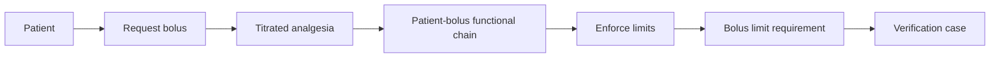

# First Workbench Session

Use the included GPCA pump to learn the workbench before opening your own model.

## 1. Build and launch

```bash
git clone https://github.com/memoarchitect/memo-architect.git
cd memo-architect
corepack enable
pnpm install
pnpm run build
pnpm run example:dev
```

Open `http://localhost:3000`.

## 2. Orient yourself

Use the explorer to find `actorPatient`, `needSafeTherapy`, and
`fcPatientBolus`. Select each element and inspect:

- its MEMO kind and layer;
- stable ID and descriptive attributes;
- incoming and outgoing relationships;
- views that include it;
- validation findings associated with it.

## 3. Follow one trace

Follow the patient-bolus scenario:



The exact view may show more detail. Focus on why each element exists and what
claim each relationship makes.

## 4. Change the viewpoint

Compare:

- a context view for external interactions;
- a functional-chain view for behavior;
- a requirements trace for derivation and coverage;
- a risk-chain view for hazard and control reasoning;
- a verification-coverage view for evidence readiness.

Notice that the same canonical element can appear in several views.

## 5. Inspect gaps

Open the problems or consistency area. Select a finding and navigate back to the
affected element. Decide whether the issue is missing information, the wrong
kind, the wrong relationship, or an intentional scope boundary.

Next, read [Layers and Their Questions](layers.md) before creating new content.
