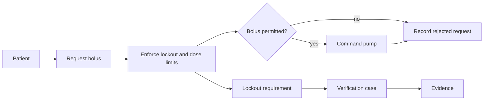

# Worked GPCA example

The bundled Generic Patient-Controlled Analgesia (GPCA) pump is the complete
MEMO reference model. It is a research example, not a reusable device design:
use its organization, traceability patterns, and review views, but never copy
its requirements, risk estimates, acceptance criteria, or evidence as a claim
about another product.

## What the example proves

GPCA is deliberately broader than a diagram demo. Its catalog contains the
clinical context, operational scenarios, requirements, functional behavior,
logical/physical/software architecture, safety risk, cybersecurity, V&V, and
document views. `gpca_trace.sysml` connects those records with typed
relationships; a view selects a review-sized projection of that same source.

Use one scenario to orient yourself. A patient requests a bolus during a
lockout interval. The model should show that the request is recognized, the
limit is enforced, no unsafe command is issued, the outcome is logged, and the
relevant requirement and risk control have verification coverage.

The arrows in this picture show the direction of the argument or outcome, not
a mandatory project phase. In the model, follow the relationship label and its
source/target roles for the authoritative meaning.

## Read the model in a useful order

| Read this | Then answer this question | Start with |
| --- | --- | --- |
| Context and operational catalog | Who is using the pump, in which setting, and what can go wrong in use? | `model/catalog/gpca_context.sysml`, `gpca_operational.sysml` |
| System and behavior catalog | What is supposed to happen for a bolus, alarm, or startup? | `gpca_system.sysml`, `gpca_behavior_actions.sysml`, `gpca_behavior_modes.sysml` |
| Requirements catalog | What measured or observable claim constrains that behavior? | `gpca_requirements.sysml` |
| Architecture and interfaces | Which hardware and software elements own the behavior and exchange information? | `gpca_architecture.sysml`, `gpca_interfaces.sysml`, `gpca_physical.sysml` |
| Risk and cybersecurity catalog | What harm or compromise is being controlled, and by what control? | `gpca_risk.sysml`, `gpca_cybersecurity.sysml` |
| Verification and trace catalog | What proves the claim, and what remains unconnected? | `gpca_verification.sysml`, `gpca_trace.sysml` |

Do not start by reading every folder. Choose one question, find the named
element, and follow its typed relationships in both directions. Repeat with
the alarm-response and startup scenarios to see which parts are reused and
which are scenario-specific.

## Use the views as review tools

| Review question | GPCA view | What a good review checks |
| --- | --- | --- |
| What is outside the pump boundary? | System context | Actors, external systems, and exchanges are explicit. |
| How is the device decomposed? | System decomposition (BDD) | Containment is clear without claiming signal direction. |
| What flows across components? | Device interconnect (IBD) | Ports and exchanges point from provider to consumer. |
| Which component owns a function? | Function allocation | An allocated function has a responsible design element. |
| What state or action happens next? | Mode state / action flow | The nominal and safety paths are distinguishable. |
| How does a fault reach harm? | Risk chain or FMEA | A control appears in the chain and is not merely a label. |
| What still lacks proof? | Verification coverage | Requirements and controls have meaningful cases and evidence. |

BDD and IBD are structural views: a BDD explains definitions and containment;
an IBD explains internal parts, ports, and directed exchanges. Treat an action
or state diagram as behavior, not as a substitute for either structural view.

## Source trail and scope

The source is in `memo/examples/gpca-pump/model` in the `memo-meta` workspace.
The `catalog` directory owns canonical elements, `gpca_trace.sysml` owns
cross-layer connections, and `views` contains purpose-built review selections.
The model also includes document views so that review artifacts can be derived
from the same source rather than becoming a second record system.

For neutral renderer fixtures that use no MEMO types, see the separate
`memo/examples/sysml-diagram-samples` project. It contains standard SysML v2
BDD, IBD, requirements, and action-flow inputs; it is intentionally not part
of GPCA.
