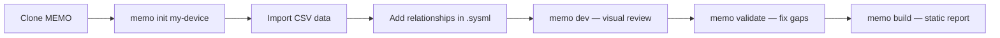

# User Guides

These guides walk you through using MEMO for a **real medical device project** — from
cloning the repo to passing design reviews with complete traceability.

## Who is this for?

- **Systems engineers** starting a new medical device and want model-based traceability
  from Day 1.
- **Software / hardware leads** who already have requirements in spreadsheets and need
  to import them into a SysML v2 model.
- **Quality / regulatory engineers** who need to demonstrate closure
  (ISO 14971, IEC 62304) before submission.

!!! tip "New to MEMO?"
    Start with the **[Medical Device Quick Start Tutorial](medical-device-tutorial.md)** —
    a single end-to-end walkthrough that takes you from cloning the repo to achieving
    full ISO traceability with your existing data.

## Guides

| Guide | What you'll learn |
|-------|-------------------|
| [Medical Device Tutorial](medical-device-tutorial.md) | **End-to-end tutorial** — import CSV data, build traceability, validate closure |
| [Starting a New Project](new-project.md) | Scaffold a project, understand the folder layout, run the dev server |
| [Importing Existing Data](importing-data.md) | Bring requirements, hazards, and components from CSV into MEMO |
| [Modeling Your Device](modeling-guide.md) | Write SysML elements, add relationships, organize by CoSMA layers |
| [Validation & Closure Rules](validation.md) | Run `memo validate`, read the gap bar, fix traceability gaps |
| [Viewpoints & Diagrams](viewpoints-diagrams.md) | Switch viewpoints, create diagrams, export for documentation |

## Typical Workflow

!!! tip "Already have requirements in Excel?"
    Jump straight to [Importing Existing Data](importing-data.md) — you can
    generate a CSV template that matches your ontology, paste your data in,
    and import with a single command.
