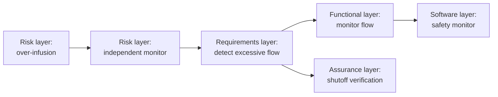

# Layers and Their Questions

Layers make a large model understandable by separating engineering questions.
They are not sequential project phases.

| Layer | Question | Typical elements |
|---|---|---|
| Context | Who uses the device, where, and with what external systems? | Actors, intended use, use context, use errors |
| Operational | What work and outcomes matter to stakeholders? | Activities, capabilities, scenarios |
| System analysis | What must the system accomplish across a scenario? | Capabilities, functional chains, functions |
| Requirements | What measurable claims must be true? | Needs, system/software/hardware requirements |
| Logical | Which implementation-neutral responsibilities exist? | Logical components, functions, exchanges |
| Software/hardware/physical | What realizes the logical design? | Software items, firmware, processing nodes, assemblies, ports |
| Risk and cybersecurity | What could cause harm or compromise, and how is it controlled? | Hazards, threats, vulnerabilities, controls |
| Assurance | What test and evidence supports each claim? | Verification cases, validation cases, evidence |

## How to use layers in Architect

1. Begin with a review question.
2. Choose the viewpoint that includes the relevant layers.
3. Select an element and follow its typed relationships across layers.
4. Switch to a neighboring viewpoint only when the question changes.

For example, a reviewer investigating over-infusion might move from:

## Organizing files

Folders may mirror layers, but the semantic kind—not the folder—determines where
an element belongs. Use files to support ownership and review; use MEMO kinds
and relationships to preserve meaning.
