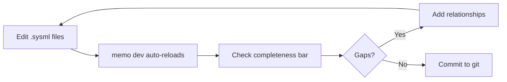

# Medical Device Quick Start Tutorial

This end-to-end tutorial walks you through setting up MEMO for a **real medical
device project** — from cloning the repo to achieving full ISO traceability.
If you already have requirements, hazards, or component lists in spreadsheets,
this guide shows you exactly how to bring them in and get value on Day 1.

---

## Who Is This For?

- **Systems engineers** kicking off a new Class II/III device and want model-based
  traceability from the start
- **Teams migrating from Excel** — you have DOORS exports, risk analysis
  spreadsheets, or BOM lists and need to bring them into a structured model
- **Regulatory / quality engineers** who need to demonstrate ISO 14971 and
  IEC 62304 closure before submission

## What You'll Achieve

By the end of this tutorial you will have:

- [x] A working MEMO project with the medical ontology
- [x] Your existing requirements, hazards, and components imported from CSV
- [x] Traceability relationships linking everything together
- [x] A visual model explorer showing completeness per CoSMA layer
- [x] Validation results showing exactly which traceability gaps remain

---

## Phase 1 — Setup (5 minutes)

### Prerequisites

| Tool | Version | Check |
|------|---------|-------|
| Node.js | >= 20 | `node --version` |
| pnpm | >= 9.15 | `pnpm --version` |
| Git | any | `git --version` |

### Clone and Build

```bash
git clone --recurse-submodules https://github.com/memoarchitect/memo-architect.git
cd memo-architect
pnpm install
pnpm build
```

### Scaffold Your Device Project

```bash
pnpm memo init my-infusion-pump
cd my-infusion-pump
```

This creates:

```
my-infusion-pump/
├── memo.config.yaml      # Extends @memo/medical-modeling-profile (250+ element kinds)
└── model/
    └── my-infusion-pump.sysml   # Starter file
```

!!! info "What does `extends: @memo/medical-modeling-profile` give you?"
    - **250+ element kinds** across 10+ CoSMA layers
    - **110+ relationship types** including cyber/integration, clinical-evidence, lifecycle-operations, data-messaging, and FMEA / fault-tree risk-analysis traces
    - **109 closure rules** aligned with ISO 14971, IEC 62304, IEC 62366, IEC 60601, FDA-aligned cybersecurity expectations, privacy/data-governance and terminology-import boundary semantics, regulated lifecycle/configuration traceability, and event-driven data-interface semantics
    - **11 viewpoints** with pre-configured SysML v2 diagrams

---

## Phase 2 — Import Your Existing Data (15 minutes)

Most teams already have data in spreadsheets. MEMO's CSV import handles
this cleanly.

### Step 2.1 — Generate Templates

```bash
# See what element kinds are available
pnpm memo ontology show

# Generate a blank CSV template with one example per kind
pnpm memo import template elements -o templates/elements.csv
pnpm memo import template relationships -o templates/relationships.csv
```

### Step 2.2 — Prepare Your Requirements CSV

Map your existing spreadsheet columns to MEMO's format:

**Your Excel columns:**
`Req ID | Title | Description | Priority | Category`

**MEMO CSV format:**
`id | name | kind | doc | priority`

Create `data/requirements.csv`:

```csv
id,name,kind,doc,priority
unFlowControl,Adjustable Flow Rate,UserNeed,Clinician needs to set and adjust infusion flow rate,High
unAlarmVisibility,Visible Alarm Indicators,UserNeed,Alarms must be visible from 3 meters,High
sysReqFlowAccuracy,Flow Rate Accuracy,SystemRequirement,System shall maintain flow rate within +-5% of set value,High
sysReqAlarmResponse,Alarm Response Time,SystemRequirement,System shall activate alarm within 2 seconds of fault detection,Critical
sysReqBattery,Battery Life,SystemRequirement,Device shall operate for 8 hours on battery,Medium
swReqPIDControl,PID Flow Control,SoftwareRequirement,Software shall implement PID control loop at 100ms interval,High
swReqAlarmManager,Alarm State Manager,SoftwareRequirement,Software shall manage alarm priorities and escalation,High
swReqDataLog,Data Logging,SoftwareRequirement,Software shall log all infusion events with timestamps,Medium
```

!!! warning "ID format rules"
    IDs must start with a letter or underscore and contain only letters,
    digits, and underscores. Rename `REQ-001` to `REQ001` or `req_001`.

### Step 2.3 — Prepare Your Hazard Analysis CSV

Map your risk analysis spreadsheet. Create `data/hazards.csv`:

```csv
id,name,kind,doc,severity
hazOverdose,Over-infusion of medication,Hazard,Uncontrolled flow rate exceeds set rate,Critical
hazUnderdose,Under-infusion of medication,Hazard,Flow rate drops below therapeutic level,Major
hazFreeFlow,Free flow condition,Hazard,Uncontrolled gravity-driven flow when set removed,Critical
hazAirEmbolism,Air in IV line,Hazard,Air bubble enters patient bloodstream,Critical
hsOccludedSensor,Occluded Flow Sensor,HazardousSituation,Sensor gives false reading due to occlusion,
hsPumpFailure,Pump Mechanism Failure,HazardousSituation,Mechanical pump stops delivering fluid,
harmOverdose,Medication Overdose,Harm,Patient receives excess medication,Critical
harmUnderdose,Subtherapeutic Dosing,Harm,Patient does not receive adequate medication,Major
rcFlowSensor,Redundant Flow Sensor,RiskControl,Hardware-based independent flow measurement,
rcAirDetector,Ultrasonic Air Detector,RiskControl,Detects air bubbles in IV line,
rcAntiFreeFlo,Anti-Free-Flow Clamp,RiskControl,Mechanical clamp prevents gravity flow,
riskOverdose,Over-infusion risk assessment,Risk,Risk of medication overdose from system malfunction,
```

### Step 2.4 — Prepare Your Architecture CSV

Create `data/architecture.csv`:

```csv
id,name,kind,doc
infusionSystem,Infusion Pump System,System,Top-level infusion pump system
fluidDelivery,Fluid Delivery Subsystem,Subsystem,Manages fluid delivery path
alarmSubsystem,Alarm Subsystem,Subsystem,Handles fault detection and alerting
mainMCU,Main MCU STM32H7,Microcontroller,Primary processor for flow control
pumpMotor,Peristaltic Pump Motor,MechanicalComponent,Primary fluid delivery mechanism
flowSensorHW,Flow Sensor Assembly,ElectricalComponent,Measures fluid flow rate
controlFW,Flow Control Firmware,Firmware,Real-time flow control software
alarmFW,Alarm Management Firmware,Firmware,Alarm detection and notification software
testFlowAccuracy,Flow Rate Accuracy Test,Test,Verify flow rate accuracy across 1-999 mL/hr
testAlarmResponse,Alarm Response Time Test,Test,Verify alarm activates within 2 seconds
testAirDetection,Air Detection Test,Test,Verify air-in-line detection sensitivity
testBattery,Battery Life Test,Test,Verify 8-hour operation on battery
```

### Step 2.5 — Import Everything

```bash
# Preview first (no files written)
pnpm memo import csv data/requirements.csv --dry-run

# Import elements into organized files
pnpm memo import csv data/requirements.csv \
  -o model/requirements/all-requirements.sysml \
  --package Requirements

pnpm memo import csv data/hazards.csv \
  -o model/risk/hazard-analysis.sysml \
  --package RiskAnalysis

pnpm memo import csv data/architecture.csv \
  -o model/architecture/system-architecture.sysml \
  --package Architecture
```

Your project now looks like:

```
my-infusion-pump/
├── memo.config.yaml
└── model/
    ├── requirements/
    │   └── all-requirements.sysml
    ├── risk/
    │   └── hazard-analysis.sysml
    └── architecture/
        └── system-architecture.sysml
```

---

## Phase 3 — Add Traceability (20 minutes)

Elements without relationships are just a list. The real value of MBSE is
**traceability** — connecting everything into a verifiable chain.

### Step 3.1 — Create the Relationships CSV

Create `data/traceability.csv`:

```csv
sourceId,targetId,type
unFlowControl,sysReqFlowAccuracy,derives
unAlarmVisibility,sysReqAlarmResponse,derives
unFlowControl,sysReqBattery,derives
sysReqFlowAccuracy,swReqPIDControl,derives
sysReqAlarmResponse,swReqAlarmManager,derives
sysReqFlowAccuracy,swReqDataLog,derives
rcFlowSensor,hazOverdose,mitigates
rcFlowSensor,hazUnderdose,mitigates
rcAirDetector,hazAirEmbolism,mitigates
rcAntiFreeFlo,hazFreeFlow,mitigates
hazOverdose,hsOccludedSensor,causes
hazFreeFlow,hsPumpFailure,causes
hsOccludedSensor,harmOverdose,leadsTo
hsPumpFailure,harmUnderdose,leadsTo
riskOverdose,hazOverdose,identifies
controlFW,sysReqFlowAccuracy,satisfy
alarmFW,sysReqAlarmResponse,satisfy
testFlowAccuracy,sysReqFlowAccuracy,verify
testAlarmResponse,sysReqAlarmResponse,verify
testAirDetection,rcAirDetector,verify
testBattery,sysReqBattery,verify
testFlowAccuracy,rcFlowSensor,verify
```

### Step 3.2 — Import Relationships

```bash
pnpm memo import csv-rel data/traceability.csv \
  -o model/traceability/connections.sysml \
  --package Traceability
```

---

## Phase 4 — Launch and Explore (2 minutes)

### Start the Dev Server

```bash
pnpm memo dev --port 3000
```

Open `http://localhost:3000` in your browser. You'll see:

### The Web UI at a Glance

| Area | What It Shows |
|------|--------------|
| **Mode Tabs** (top) | Model Explorer, Diagram, Scenarios, Ontology |
| **Completeness Bar** (below tabs) | Per-layer completeness with color segments |
| **Left Sidebar** | Element tree grouped by V-cycle category |
| **Center** | Diagram canvas (in Diagram mode) or detail panel (in Explorer mode) |
| **Right Sidebar** | Properties of selected element or diagram |
| **Gap Bar** (bottom) | Closure rule violations with element links |

### Try These Actions

1. **Model Explorer tab** — expand tree groups to see all your imported elements
2. **Click any element** — see its properties, relationships, and validation status
3. **Diagram tab** — switch to Diagram mode to see the visual graph
4. **Select a viewpoint** — click "Risk Overview" to see only the hazard chain
5. **Check the gap bar** — see which closure rules still have violations

---

## Phase 5 — Validate and Fix Gaps (10 minutes)

### Run Validation

```bash
pnpm memo validate
```

You'll see output like:

```
MEMO Validate — my-infusion-pump

Checking 109 closure rules against 24 elements...

✗ CR-MED-002  hazAirEmbolism — Every Hazard must cause at least one HazardousSituation
✗ CR-MED-007  swReqAlarmManager — Every SoftwareRequirement must derive from a SystemRequirement
⚠ CR-MED-011  controlFW — Every Software must have safetyClassification attribute
⚠ CR-MED-012  ucRespondToAlarm — Every UseCase should be refined by a Scenario

Results: 2 errors, 2 warnings — 87% complete
```

### Fix the Gaps

The validation tells you exactly what's missing. Fix by adding the missing
elements or stronger traceability connections:

**Add the missing requirement derivation and scenario refinement**:

```sysml
package RequirementsAndBehavior {
    import MEMO_Ontology_Medical::*;
    requirement sysReqAlarmResponse : SystemRequirement {
        attribute redefines title = "Alarm Response";
    }

    requirement swReqAlarmManager : SoftwareRequirement {
        attribute redefines title = "Alarm Manager";
    }

    part ucRespondToAlarm : UseCase {
        attribute redefines name = "Respond To Alarm";
    }

    action occlusionAlarmScenario : Scenario {
        attribute redefines name = "Occlusion Alarm Response";
    }

    connection : Derives connect source ::> sysReqAlarmResponse to derived ::> swReqAlarmManager;
    connection : Refines connect refined ::> ucRespondToAlarm to refiner ::> occlusionAlarmScenario;
}
```

**Add the missing hazardous situation**:

```sysml
package RiskModel {
    import MEMO_Ontology_Medical::*;

    requirement hazAirEmbolism : Hazard {
        attribute redefines title = "Air Embolism";
    }

    requirement hsAirInLine : HazardousSituation {
        attribute redefines title = "Air detected in infusion line during therapy";
    }

    connection : Causes connect hazard ::> hazAirEmbolism to situation ::> hsAirInLine;
}
```

**Add safety classification** to software elements:

```sysml
// In model/architecture/system-architecture.sysml, update:
part controlFW : Firmware {
    attribute redefines name = "Flow Control Firmware";
    attribute redefines safetyClassification = "C";  // IEC 62304 Class C
}

part alarmFW : Firmware {
    attribute redefines name = "Alarm Management Firmware";
    attribute redefines safetyClassification = "B";
}
```

Run validation again — watch the completeness climb toward 100%.

---

## Phase 6 — Ongoing Workflow

### Daily Development Cycle



### Adding New Elements

=== "Write SysML directly"

    ```sysml
    requirement newReq : SystemRequirement {
        attribute redefines title = "New Requirement";
        attribute redefines priority = "High";
        doc /* Description of the requirement */
    }
    ```

=== "Import from CSV"

    ```bash
    # Add to an existing CSV and re-import
    pnpm memo import csv new-elements.csv -o model/requirements/new.sysml
    ```

### Before Design Reviews

1. Run `pnpm memo validate` — fix all errors
2. Switch to the relevant viewpoint (e.g., "Risk Overview" for ISO 14971 review)
3. Export diagrams for the review package:
   ```bash
   pnpm memo export dot -o diagrams/risk-chain.dot --viewpoint risk-overview
   dot -Tpng diagrams/risk-chain.dot -o diagrams/risk-chain.png
   ```

### In CI/CD

```yaml
# .github/workflows/model-check.yml
name: Model Validation
on: [push, pull_request]
jobs:
  validate:
    runs-on: ubuntu-latest
    steps:
      - uses: actions/checkout@v4
      - uses: pnpm/action-setup@v4
      - run: pnpm install && pnpm build
      - run: pnpm memo validate
```

---

## Recommended Project Structure

```
my-device/
├── memo.config.yaml                 # Project config (extends @memo/medical-modeling-profile)
├── data/                            # Source CSV files (keep for reference)
│   ├── requirements.csv
│   ├── hazards.csv
│   └── traceability.csv
├── model/                           # SysML v2 model files
│   ├── purpose/
│   │   ├── actors.sysml             # Stakeholders, actors
│   │   └── stakeholder-concerns.sysml
│   ├── requirements/
│   │   ├── user-needs.sysml
│   │   ├── system-requirements.sysml
│   │   └── software-requirements.sysml
│   ├── risk/
│   │   ├── hazards.sysml            # Hazards, haz situations, harms
│   │   ├── risk-controls.sysml      # Risk controls
│   │   └── risk-chain.sysml         # Risk identification
│   ├── architecture/
│   │   ├── logical.sysml            # System, subsystems
│   │   ├── physical.sysml           # MCUs, electrical, mechanical
│   │   └── software.sysml           # Firmware, software components
│   ├── functional/
│   │   ├── use-cases.sysml
│   │   └── functions.sysml          # System functions, allocation
│   ├── interfaces/
│   │   └── ports.sysml              # Ports, interfaces, data types
│   ├── verification/
│   │   └── tests.sysml              # Test definitions
│   └── traceability/
│       └── connections.sysml        # All relationship connections
└── .github/
    └── workflows/
        └── validate.yml             # CI validation
```

---

## Common Scenarios

### "I have a DOORS export with 500+ requirements"

1. Export from DOORS as CSV
2. Map columns: DOORS Object ID → `id`, Object Text → `name`, Object Type → `kind`
3. Run `pnpm memo import csv doors-export.csv -o model/requirements/doors-import.sysml`
4. The importer validates each row and warns about unknown kinds

### "I have a risk analysis in Excel (ISO 14971)"

1. Create separate CSVs for hazards, hazardous situations, harms, and risk controls
2. Import each with the appropriate kinds
3. Create a relationships CSV mapping the risk chain (causes, leadsTo, mitigates, identifies)
4. Use the Risk Overview viewpoint to visually verify the chain

### "I need to show traceability for a 510(k) submission"

1. Ensure all closure rules pass: `pnpm memo validate`
2. Switch to each relevant viewpoint and export diagrams
3. Use `pnpm memo build -o dist` for a static HTML report
4. The completeness percentage provides objective evidence of traceability coverage

### "Multiple engineers working on the same model"

MEMO models are **plain text SysML files** stored in Git:

- Each engineer works on different files (by layer or subsystem)
- Standard Git merge handles concurrent edits
- CI validation catches broken traceability on every PR
- The model directory structure keeps files organized

---

## Quick Reference Card

### CLI Commands

| Command | What It Does |
|---------|-------------|
| `pnpm memo init <name>` | Scaffold a new project |
| `pnpm memo dev --port 3000` | Launch dev server with live reload |
| `pnpm memo validate` | Check all closure rules |
| `pnpm memo import csv <file>` | Import elements from CSV |
| `pnpm memo import csv-rel <file>` | Import relationships from CSV |
| `pnpm memo import template elements` | Generate element CSV template |
| `pnpm memo import template relationships` | Generate relationship CSV template |
| `pnpm memo ontology show` | List all available element kinds |
| `pnpm memo export dot -o <file>` | Export as Graphviz DOT |
| `pnpm memo export json -o <file>` | Export as JSON |
| `pnpm memo build -o <dir>` | Build static HTML report |

### Key Relationship Types

| Relationship | Pattern | ISO Standard |
|-------------|---------|-------------|
| `derives` | Need/Requirement → derived Requirement | IEC 62304 |
| `satisfy` | LogicalComponent → Requirement | IEC 62304 |
| `verify` | Test → Requirement | IEC 62304 |
| `mitigates` | RiskControl → Hazard | ISO 14971 |
| `causes` | Hazard → HazardousSituation | ISO 14971 |
| `leadsTo` | HazardousSituation → Harm | ISO 14971 |
| `identifies` | Risk → Hazard | ISO 14971 |
| `allocateTo` | Function → LogicalComponent | Systems Engineering |

### CoSMA Layers

| Layer | Element Examples | Color |
|-------|-----------------|-------|
| Purpose | Actor, Stakeholder, Goal | Pink |
| Requirements | UserNeed, SystemRequirement | Blue |
| Risk | Hazard, RiskControl, Harm | Red |
| Functional | UseCase, Scenario, SystemFunction | Orange |
| Logical | System, Subsystem, LogicalComponent | Indigo |
| Physical | Microcontroller, ElectricalComponent | Teal |
| Software | Software, Firmware | Purple |
| Interfaces | Port, Interface, DataType | Green |
| Verification | Test | Yellow |
| UI | UIScreen, UIElement | Slate |

UI elements in the medical ontology are modeled as product software realization elements, so they can satisfy `UserInterfaceRequirement` instances and participate in risk traceability.

---

## Next Steps

- **Need more element kinds?** → see `docs/architecture/platform.md` and `docs/design/sysmlv2-rulebook.md`
- **Want to customize rules?** → [Validation & Closure Rules](validation.md)
- **Creating diagrams for reviews?** → [Viewpoints & Diagrams](viewpoints-diagrams.md)
- **Setting up CI?** → [Configuration Reference](../developers/config/reference.md)
