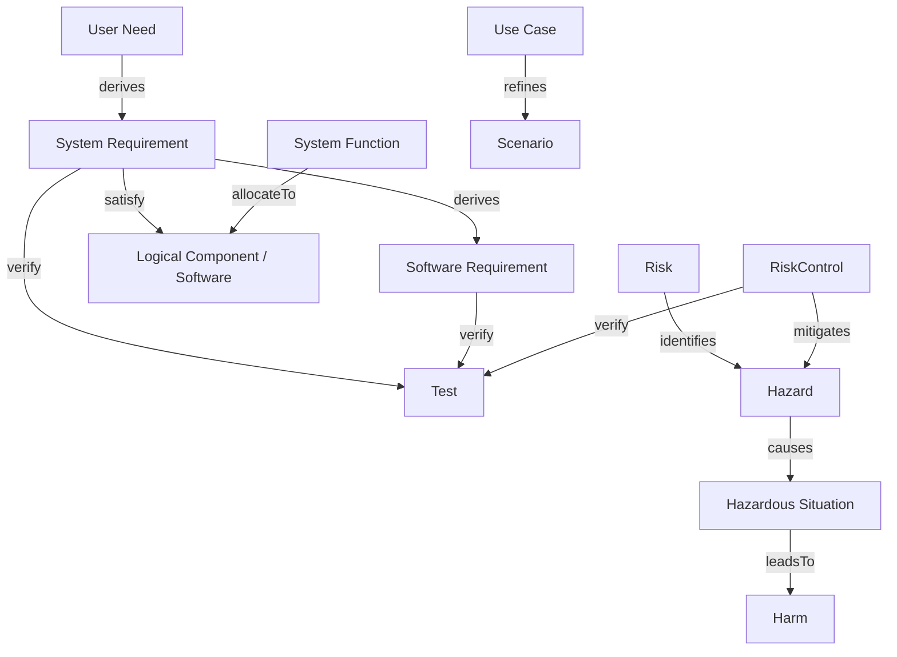

# Modeling Your Device

This guide shows how to build a complete, traceable medical device model
in MEMO using SysML v2. Whether you started from scratch or imported CSV
data, this is where you connect everything together.

## The ISO Traceability Chain

Medical devices require end-to-end traceability. MEMO's closure rules
enforce this chain:



Your goal is to fill in this chain for every element in your model.

## Element Patterns

### Requirements (IEC 62304 / ISO 13485)

```sysml
// User needs — medical-facing specialization of core StakeholderNeed
requirement unFlowControl : UserNeed {
    attribute redefines title = "Adjustable Flow Rate";
    doc /* Clinician needs to set and adjust infusion flow rate */
}

// System requirements — what the system must do
requirement sysReqFlowAccuracy : SystemRequirement {
    attribute redefines title = "Flow Rate Accuracy";
    attribute redefines priority = "High";
    doc /* System shall maintain flow rate within +-5% of set value */
}

// Software requirements — what the software must do
requirement swReqPIDControl : SoftwareRequirement {
    attribute redefines title = "PID Flow Control";
    attribute redefines safetyClassification = "C";
    doc /* Software shall implement PID control loop at 100ms interval */
}

// Requirement derivation flows from need -> system -> software
connection : Derives connect source ::> unFlowControl to derived ::> sysReqFlowAccuracy;
connection : Derives connect source ::> sysReqFlowAccuracy to derived ::> swReqPIDControl;
```

### Risk Management (ISO 14971)

```sysml
// The hazard
requirement hazOverdose : Hazard {
    attribute redefines title = "Over-infusion";
}

// What situation leads to it
requirement hsOccludedSensor : HazardousSituation {
    attribute redefines title = "Occluded Flow Sensor";
}

// The resulting harm
requirement harmOverdose : Harm {
    attribute redefines title = "Medication Overdose";
    attribute redefines severity = "Critical";
}

// The risk chain
connection : causes connect hazOverdose to hsOccludedSensor;
connection : leadsTo connect hsOccludedSensor to harmOverdose;

// Risk control
requirement rcFlowSensor : RiskControl {
    attribute redefines title = "Redundant Flow Sensor";
}
connection : Mitigates connect control ::> rcFlowSensor to hazard ::> hazOverdose;
```

### Architecture

```sysml
// Logical decomposition
part infusionPumpSystem : System {
    attribute redefines name = "Infusion Pump System";
}

part fluidDeliverySubsystem : Subsystem {
    attribute redefines name = "Fluid Delivery Subsystem";
}

// Physical components
part mainMCU : Microcontroller {
    attribute redefines name = "Main MCU (STM32H7)";
    attribute redefines manufacturer = "STMicroelectronics";
}

part pumpMotor : MechanicalComponent {
    attribute redefines name = "Peristaltic Pump Motor";
}

// Software
part controlFirmware : Firmware {
    attribute redefines name = "Flow Control Firmware";
    attribute redefines safetyClassification = "C";
}

// Allocation: function → component
connection : allocateTo connect sfFlowControl to fluidDeliverySubsystem;
connection : satisfy connect controlFirmware to sysReqFlowAccuracy;
```

### Verification

```sysml
part testFlowAccuracy : Test {
    attribute redefines name = "Flow Rate Accuracy Test";
    attribute redefines testType = "Integration";
    doc /* Verify flow rate accuracy across 1-999 mL/hr range */
}

// Link test to requirements
connection : verify connect testFlowAccuracy to sysReqFlowAccuracy;
connection : verify connect testFlowAccuracy to rcFlowSensor;
```

## Relationship Reference

Use these relationship types to build traceability:

| Relationship | From → To | Purpose |
|-------------|-----------|---------|
| `derives` | Need/Requirement → derived Requirement | Requirements decomposition with stable semantics |
| `refines` | UseCase / concern → scenario / refiner | Refinement when generic tracing is too weak |
| `traceTo` | Element → Element | Fallback trace when no stronger stable semantics apply |
| `satisfy` | LogicalComponent → Requirement | Design satisfies requirement |
| `verify` | Test → Requirement / RiskControl | Verification coverage |
| `allocateTo` | Function → LogicalComponent | Functional allocation |
| `mitigates` | RiskControl → Hazard | Risk mitigation |
| `causes` | Hazard → HazardousSituation | Causal chain |
| `leadsTo` | HazardousSituation → Harm | Consequence chain |
| `identifies` | Risk → Hazard | Risk identification |
| `composedOf` | System → Subsystem | Structural decomposition |

## Organizing Files

### By CoSMA Layer (recommended)

Organize source files by each element's semantic home. Use viewpoints such as
physical, software, risk, usability, and safety for reviews; do not treat
viewpoints as the primary ownership boundary for the ontology or model files.

```
model/
├── purpose/
│   ├── actors.sysml
│   └── stakeholder-concerns.sysml
├── requirements/
│   ├── user-needs.sysml
│   ├── system-requirements.sysml
│   └── software-requirements.sysml
├── functional/
│   ├── use-cases.sysml
│   └── system-functions.sysml
├── risk/
│   ├── hazards.sysml
│   ├── risk-controls.sysml
│   └── risk-chain.sysml
├── architecture/
│   ├── logical.sysml
│   ├── physical.sysml
│   └── software.sysml
├── interfaces/
│   └── ports-interfaces.sysml
├── verification/
│   └── tests.sysml
└── traceability/
    └── connections.sysml
```

### Cross-File References

Each file uses its own `package` block. Reference elements across packages
with `import`:

```sysml
// In requirements/system-requirements.sysml
package SystemRequirements {
    import MEMO_Ontology_Medical::*;

    requirement sysReq001 : SystemRequirement {
        attribute redefines title = "Flow Accuracy";
    }
}
```

```sysml
// In verification/tests.sysml
package Verification {
    import MEMO_Ontology_Medical::*;
    import SystemRequirements::*;

    part testFlow : Test {
        attribute redefines name = "Flow Accuracy Test";
    }

    connection : verify connect testFlow to sysReq001;
}
```

## Attributes

Each kind has default attributes defined in the ontology. You can set them
with `attribute redefines`:

```sysml
requirement myReq : SystemRequirement {
    attribute redefines title = "My Requirement";
    attribute redefines priority = "High";
    attribute redefines status = "Draft";
    attribute redefines rationale = "Needed for FDA 510(k)";
}
```

Requirements and risk claims generally use `title`. Parts and actions
generally use `name`.

You can also add custom attributes:

```sysml
part myComponent : ElectricalComponent {
    attribute redefines name = "Power Supply";
    attribute voltage = "5V";
    attribute current = "2A";
}
```

## Tips for Effective Modeling

!!! tip "Start with the risk chain"
    For medical devices, start by modeling your hazards, risk controls, and
    the mitigation chain. Then trace backwards to requirements and forward
    to tests. This ensures your most critical traceability is in place first.

!!! tip "Use `memo validate` early and often"
    Run validation after every major editing session. The closure rules will
    tell you exactly which connections are missing.

!!! tip "Name IDs consistently"
    Use prefixes that indicate the kind:
    `un_` for stakeholder/user needs, `sysReq_` for SystemRequirement,
    `haz_` for Hazard, `rc_` for RiskControl, `test_` for Test

!!! tip "One relationship file"
    Consider keeping all `connection` statements in a single
    `traceability/connections.sysml` file. This makes it easy to review
    the full traceability matrix.

## Next Steps

- [Validation & Closure Rules](validation.md) — check your model is complete
- [Viewpoints & Diagrams](viewpoints-diagrams.md) — visualize specific aspects
