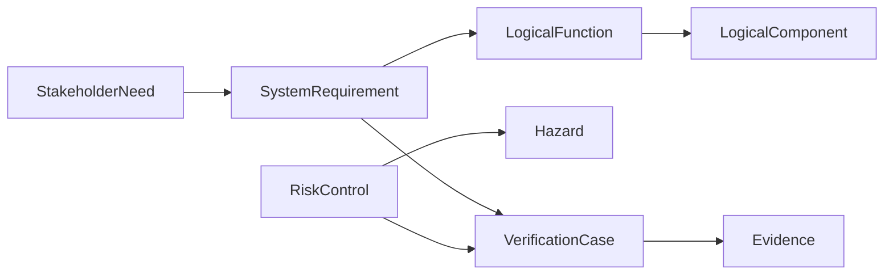

# Model Your Device

Model one engineering argument at a time:



## Define the elements

```sysml
package infusion_pump {
    private import memo_medical_device_library::*;

    requirement safeDelivery : StakeholderNeed {
        attribute :>> id = "NEED-001";
        attribute :>> name = "SafeDelivery";
        attribute :>> statement =
            "The patient needs medication delivered without unintended over-infusion.";
    }

    requirement detectOverDelivery : SystemRequirement {
        attribute :>> id = "REQ-001";
        attribute :>> name = "DetectOverDelivery";
        attribute :>> statement =
            "The pump shall detect flow above the configured limit.";
    }

    part monitorFlow : LogicalFunction {
        attribute :>> id = "LF-001";
        attribute :>> name = "MonitorFlow";
    }

    part safetyMonitor : LogicalComponent {
        attribute :>> id = "LC-001";
        attribute :>> name = "SafetyMonitor";
    }

    item overInfusion : Hazard {
        attribute :>> id = "HAZ-001";
        attribute :>> name = "OverInfusion";
    }

    item independentMonitor : RiskControl {
        attribute :>> id = "RC-001";
        attribute :>> name = "IndependentFlowMonitor";
    }

    part shutoffTest : VerificationCase {
        attribute :>> id = "VER-001";
        attribute :>> name = "OverDeliveryShutoffTest";
    }
}
```

## Connect the argument

```sysml
connection : DerivesFrom
    connect sourceDriver ::> safeDelivery
    to targetRequirement ::> detectOverDelivery;

connection : AllocatedTo
    connect function ::> monitorFlow
    to allocatedElement ::> safetyMonitor;

connection : MitigatesHazard
    connect riskControl ::> independentMonitor
    to mitigatedHazard ::> overInfusion;

connection : VerifiedBy
    connect verificationTarget ::> detectOverDelivery
    to verificationCase ::> shutoffTest;

connection : VerifiedBy
    connect verificationTarget ::> independentMonitor
    to verificationCase ::> shutoffTest;
```

## Review the slice

Ask:

- Is the need written in stakeholder language?
- Is the requirement measurable?
- Is the function independent of implementation?
- Is component responsibility explicit?
- Does the control genuinely reduce the hazard?
- Does the verification case test both the requirement and the control?

Use [Choosing Elements](elements.md) and
[Connecting Elements](relationships.md) when extending the slice.
