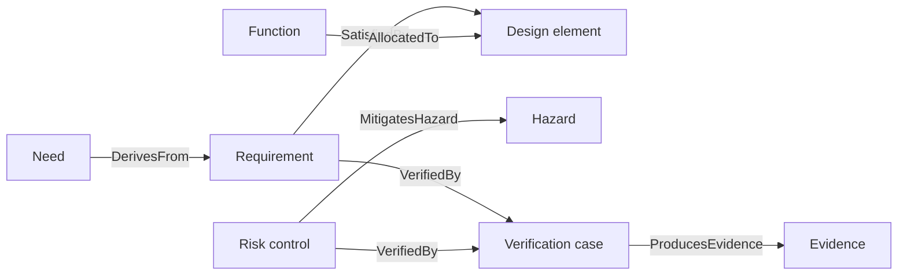

# Connecting Elements

Relationships turn a catalog into an engineering argument. In Architect, follow
them to understand why an element exists, what it affects, and how it is
supported.

## Core traceability chain

| Relationship | Read it as |
|---|---|
| `DerivesFrom` | This requirement is driven by this need, hazard, or source |
| `SatisfiedBy` | This design element satisfies this requirement |
| `AllocatedTo` | This component owns this function or responsibility |
| `VerifiedBy` | This verification case checks this claim |
| `ProducesEvidence` | This assurance activity produced this evidence |
| `MitigatesHazard` | This risk control reduces this hazard |
| `DeploysOnto` | This software executes on this processing node |
| `RealizesInterface` | This design element realizes this interface |

## Inspecting a relationship

When selecting an edge or trace row, verify:

1. the relationship type is more precise than a generic trace;
2. source and target roles are in the correct direction;
3. both endpoints are the intended canonical elements;
4. the claim has an engineering rationale;
5. a reviewer could challenge and resolve the claim.

## Do not optimize for edge count

More relationships do not automatically mean better traceability. Add the links
needed to support a clear argument and satisfy justified closure expectations.
Avoid speculative or duplicated links that hide uncertainty.
