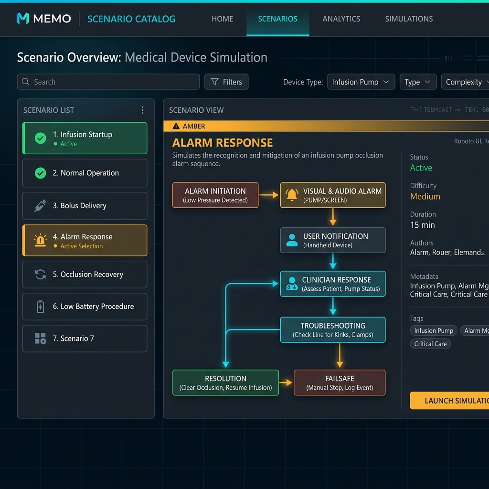
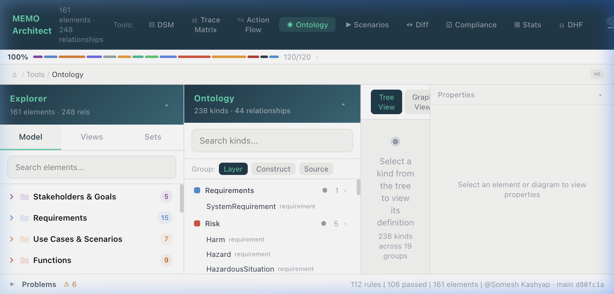
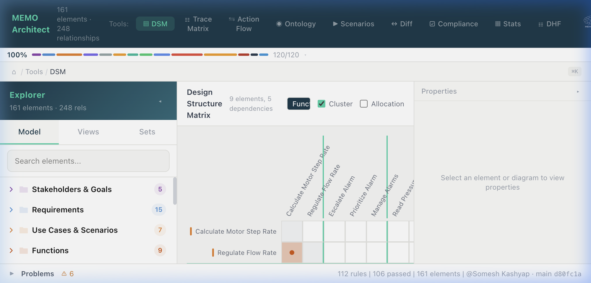
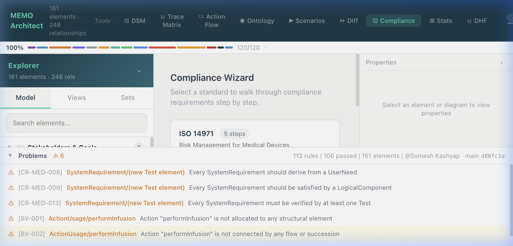
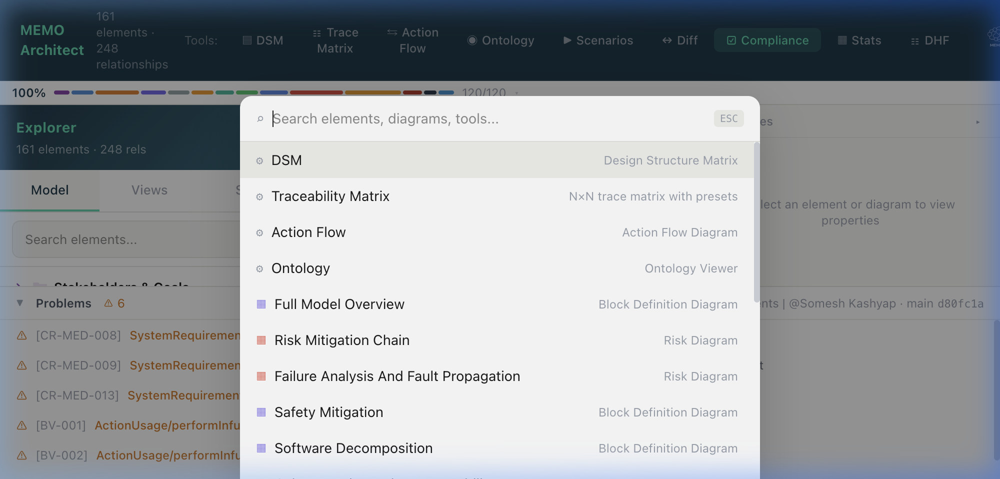

# Workbench UI Usage

The **MEMO Architect Workbench** is a unified environment for systems modeling, analysis, and refinement. This guide covers the key interface components and how to interact with your model visually.

## Interface Overview

The interface is divided into four main areas:

1.  **Sidebar (Model Explorer):** Navigate the hierarchy of your model elements, organized by layer (Operational, Functional, Logical, Physical).
2.  **Breadcrumb / Toolbar:** Shows your current location in the model and provides access to different views (Diagram, Properties, Ontology).
3.  **Main Viewport:** Where diagrams are rendered and model elements are edited.
4.  **Property Panel:** (Optional) Context-sensitive details for the currently selected element in a diagram.

## 2. Workbench Modes

The top toolbar allows you to switch between the primary modes of the application.

### Modeling Workbench
The default mode for architectural modeling. It features a dual-sidebar layout:
- **Model Explorer:** (Top Left) Browse and search the semantic model elements by layer and kind.
- **View Explorer:** (Bottom Left) Navigate the diagrams and analysis views defined in your project's viewpoints.
- **Properties Panel:** (Right) Edit elementary attributes and view relationship traces.

### Scenario Catalog
A dedicated space for behavior engineering, focusing on user activities and system scenarios.

<!--  -->
*The Scenario Catalog showing an infusion pump alarm response flow.*

### Ontology Viewer
A "Read-Only" mode for exploring the metamodel rules and relationship schemas enforced by your current modeling profile.

*Hierarchical view of the '@memo/ontology-medical' kind registry.*

---

## 3. Analysis & Compliance

MEMO includes integrated tools for real-time model analysis.

### DSM Matrix
Click the **DSM** icon to open the Design Structure Matrix for dependency clustering.

### Consistency Panel
The **Problems** bar at the bottom reflects both schema violations and logical consistency issues.

---

## 4. Interaction & Productivity

- **Command Palette (Cmd+K):** The central hub for AI-powered actions. Press `Cmd+K` and use `/ask` for model Q&A or `/generate` for SysML creation.

- **Diagram Interactions:** 
    - **Double-click:** Enter a container (Subsystem, Action) to see internal structure.
    - **Hover:** Highlight connected traces across the canvas.
    - **Breadcrumbs:** Use the breadcrumb bar to navigate back up the model hierarchy.
