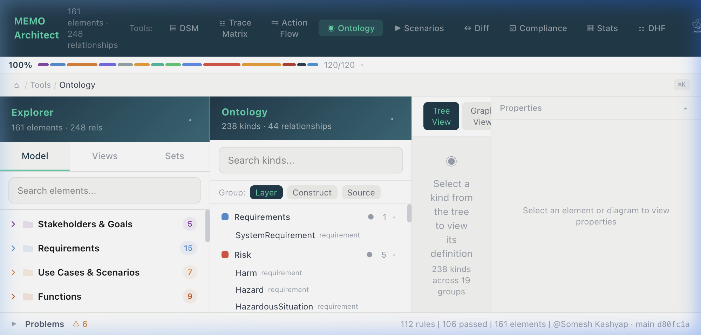

# Use the Workbench

Start with a question, not a canvas. Architect is most useful when you can say
what you need to review—for example, “which control mitigates this hazard?” or
“does this requirement have verification evidence?” Then choose the smallest
view that can answer it.

## Orient yourself

The workbench gives the same model three complementary entry points:

| Area | Use it for | Good first action |
|---|---|---|
| **Model Explorer** (top nav) | Find elements by layer, kind, or name | Open one known requirement, function, or hazard |
| **Diagrams** (top nav) | Select the viewpoint for a review question | Choose context, risk, requirements, or verification |
| **Main view** | Read the selected diagram, table, or analysis | Follow one relationship at a time |
| **Details and findings** | Inspect attributes, links, and validation messages | Decide whether a gap is real, intentional, or a modeling error |

The top navigation also carries **DHF**, **Scenarios**, **Ontology**, **Import**, and a
**Tools** menu holding the cross-cutting analyses (Design Structure Matrix, Traceability
Matrix, Statistics Dashboard, Compliance Wizard, and Model Diff).

## A five-minute review

Use the included GPCA model and trace a single patient-bolus concern.

1. In the Model Explorer, open `needSafeTherapy`.
2. Read its outgoing and incoming relationships. They explain why the need is
   present and what claims depend on it.
3. Switch to a requirements or functional view to see the design response.
4. Switch to a risk view to find the related hazard and control.
5. Switch to verification coverage to see whether the requirement has an
   associated verification case and evidence.

If a view becomes crowded, return to the selected element and ask a narrower
question. A crowded diagram is a sign to change the lens, not to add another
copy of the model.

## Explore the current vocabulary

Open the **Ontology** tab when you are unsure which element kind or relationship
belongs in a model. It shows the vocabulary selected by the project's active profile;
it is a reference, not a second place to author project meaning.

## Find dependencies and gaps

**Tools → Design Structure Matrix** highlights dependency patterns. Use it to prepare a
technical discussion, then return to the connected elements to understand the
engineering reason for a dependency.

The **Problems** area reports validation and consistency findings. Treat each
finding as a review prompt: inspect the affected source and decide whether to
add missing information, correct a relationship, or document an explicit scope
boundary.

## Optional assistance

Where a provider is configured, the **AI Tools** section under the **DHF** tab can help
query or draft model content. Review generated text and all source changes as carefully
as any other engineering input; assistance does not approve a requirement, risk control,
or evidence claim.

The assistant cannot write to the model on its own. Edits it suggests are staged as
proposals and are written only when you approve them. See
[Intelligence & AI](ai-features.md) for setup and behaviour, and
[AI Coding Tools (MCP)](mcp-cursor.md) to use the model from Cursor or Claude Code.
